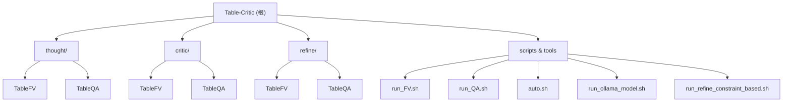
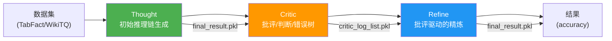

# Table-Critic 项目文档

## 变更记录 (Changelog)

| 日期 | 操作 | 说明 |
|------|------|------|
| 2026-04-10 | 初始化 | 由架构师扫描生成，覆盖全部 6 个模块 |

---

## 项目愿景

Table-Critic 是一个基于大语言模型（LLM）的多智能体表格推理框架，发表于 ACL 2025 主会。核心思想是通过 **Critic（批评者）** 与 **Refine（精炼者）** 两个智能体的协作，对初始思维链推理（Thought）结果进行迭代式批评和修正，从而提升表格事实验证（Table Fact Verification）和表格问答（Table Question Answering）的准确率。

---

## 架构总览



### 数据流



### 三阶段流水线

1. **Thought 阶段** -- 使用 LLM 动态生成表格操作链（add_column, select_row, select_column, group_column, sort_column），逐步变换表格直到得出最终答案。
2. **Critic 阶段** -- 对 Thought 结果进行三级审查：
   - **Judge**：判断答案正确/错误
   - **Tree**：定位错误类型路径（错误树分类）
   - **Critic**：给出具体批评和错误步骤
3. **Refine 阶段** -- 根据 Critic 的反馈，从错误步骤处重新生成操作链并执行，最多迭代 5 轮直到 Judge 判定正确。

---

## 模块索引

| 模块路径 | 职责 | 语言 | 入口文件 | 有测试 |
|----------|------|------|----------|--------|
| `thought/TableFV` | TableFV 任务的初始推理链生成 | Python | `main.py` | 否 |
| `thought/TableQA` | TableQA 任务的初始推理链生成 | Python | `main.py` | 否 |
| `critic/TableFV` | TableFV 任务的批评分析 | Python | `main.py` | 否 |
| `critic/TableQA` | TableQA 任务的批评分析 | Python | `main.py` | 否 |
| `refine/TableFV` | TableFV 任务的批评驱动精炼 | Python | `main_tree_based.py` | 否 |
| `refine/TableQA` | TableQA 任务的批评驱动精炼 | Python | `main_tree_based.py` / `main_constraint_based.py` | 否 |

---

## 技术栈

| 类别 | 技术 |
|------|------|
| 语言 | Python 3.10+ |
| LLM 调用 | OpenAI SDK (v1.57.0)，兼容任何 OpenAI API 格式的服务 |
| 数据处理 | pandas, numpy, pylcs |
| 多进程 | multiprocessing (Pool + imap_unordered) |
| CLI 参数 | Google Fire |
| 进度条 | tqdm |
| 数据集 | TabFact (事实验证), WikiTableQuestions (表格问答) |
| 本地部署 | Ollama (可选) |

### 依赖列表 (`requirements.txt`)

- `fire` -- CLI 参数解析
- `numpy` -- 数值计算
- `pandas` -- 表格数据处理
- `tqdm` -- 进度条
- `openai==1.57.0` -- LLM API 调用
- `pylcs` -- 最长公共子序列（字符串匹配评估用）

---

## 全局规范

### 编码风格
- Python 文件使用 4 空格缩进
- 模块间通过 `sys.path.append()` 进行路径注入，而非包管理
- 每个阶段/任务组合（如 `thought/TableFV`）有独立的 `utils/`、`operations/` 目录
- `operations/` 中的文件导出 `*_func`（执行函数）和 `*_act`（回放函数）两种接口

### 命名约定
- 目录命名：`{phase}/{task}`，其中 phase = thought/critic/refine，task = TableFV/TableQA
- 结果目录：`results/{phase}/{dataset}/{model_name}/`
- 缓存文件：`cache/case-{idx}.pkl`
- 操作函数：`{operation}_func`（生成参数）+ `{operation}_act`（回放操作）

### 关键数据结构
- **sample (dict)**：核心数据单元，包含 `id`, `statement`, `table_text`, `table_caption`, `chain`, `label` 等字段
- **chain (list)**：操作链，每步包含 `operation_name`, `parameter_and_conf`, 可选 `thought`
- **table_text (list)**：二维列表，`[header, row1, row2, ...]`

---

## 运行方式

### 环境准备

```bash
conda create --name TableCritic python=3.10 -y
conda activate TableCritic
pip install -r requirements.txt
```

### API 配置

在 `run_FV.sh` 和 `run_QA.sh` 中设置：
- `base_url` -- LLM API 地址
- `openai_api_key` -- API 密钥（支持环境变量如 `$DASHSCOPE_API_KEY`）
- `model_name` -- 模型名称（如 `glm-5`, `gpt-5.4`, `qwen2.5-72b-instruct`）

### 运行 Table Fact Verification (FV)

```bash
# 编辑 run_FV.sh 配置 API 参数后执行
bash run_FV.sh
```

等价于依次执行：
1. `python thought/TableFV/main.py` -- 生成初始推理链
2. `python refine/TableFV/main_tree_based.py` -- 批评驱动的精炼

### 运行 Table Question Answering (QA)

```bash
# 编辑 run_QA.sh 配置 API 参数后执行
bash run_QA.sh
```

### 使用 Ollama 本地运行

```bash
# 自动运行 FV + QA
bash auto.sh -m qwen3:14b -n 100

# 单独运行 FV
bash run_ollama_model.sh -t FV -m qwen3:32b -n 100

# 单独运行 QA
bash run_ollama_model.sh -t QA -m qwen3:14b -n 100
```

### 约束诱导式推理（实验性）

```bash
bash run_refine_constraint_based.sh -m qwen3:32b
```

### 通用命令行参数

| 参数 | 说明 | 默认值 |
|------|------|--------|
| `--base_url` | LLM API 基础 URL | (必填) |
| `--openai_api_key` | API 密钥 | `EMPTY` |
| `--model_name` | 模型名称 | `qwen2.5-72b-instruct` |
| `--thought_results_dir` | Thought 结果目录 | `results/thought/{dataset}/{model}` |
| `--refine_results_dir` | Refine 结果目录 | `results/refine/{dataset}/{model}` |
| `--first_n` | 处理前 N 个样本 (-1 为全部) | `-1` |
| `--n_proc` | 多进程进程数 | `8` |
| `--chunk_size` | 多进程分块大小 | `4` |

---

## 关键配置

### LLM 调用参数
- 温度策略：操作规划用 `temperature=0.0`（确定性），参数生成用 `temperature=0.5`（多样性，`n_sample=4`）
- 最大解码步数：操作规划 `150`，最终查询 `2048`
- 超时时间：`600s`（10 分钟）
- 重试策略：最多重试 2 次，间隔 60 秒
- 非 GPT 模型会添加 `enable_thinking: false` 参数（关闭思考模式）

### Critic 阶段的错误树
- 存储在 `critic/{task}/tools/few_shot_critic.json` 中
- 支持动态扩展（垂直扩展和水平扩展）
- 路径格式：如 `sub-table error -> row error`

### Refine 迭代上限
- 最大迭代轮次：5 轮
- 每轮执行 Judge -> Tree -> Critic -> Refine Chain -> Query 的完整循环

---

## 测试策略

本项目目前**没有自动化单元测试**。验证方式为：
1. 运行完整流水线后，查看 `acc.txt` / `result.txt` 中的准确率
2. 使用 `cal_acc.py` 脚本对已有结果重新计算准确率
3. 使用 `visualize_results.py` 可视化分析各阶段样本数据

---

## AI 使用指引

- 修改 `thought/` 模块时，注意 FV 和 QA 版本在 prompt 用词上的差异（FV 用 "Statement"，QA 用 "Question"）
- `operations/` 目录中 `*_func` 是带 LLM 调用的执行函数，`*_act` 是纯函数回放
- `chain.py` 是最核心的文件，包含动态链生成、多进程执行、Critic-Refine 循环等逻辑
- 添加新操作需要在 `operations/__init__.py` 中导出，并在 `chain.py` 的 `possible_next_operation_dict` 和 `operation_parameter_dict` 中注册
- `sys.path.append()` 的顺序很重要：refine 阶段需要同时引入 critic 和 refine 的路径
- 缓存机制（`case-{idx}.pkl`）允许断点续跑，删除 cache 目录即可重新执行

---

## 相关文件清单

### 根目录脚本
- `run_FV.sh` -- FV 任务运行脚本（远程 API）
- `run_QA.sh` -- QA 任务运行脚本（远程 API）
- `auto.sh` -- 自动化全流程脚本（Ollama）
- `run_ollama_model.sh` -- Ollama 单任务运行脚本
- `run_refine_constraint_based.sh` -- 约束推理运行脚本
- `order.sh` -- 任务编排脚本
- `cal_acc.py` -- 准确率计算工具
- `visualize_results.py` -- 结果可视化工具
- `pkl.py` -- pkl 文件读取工具

### 数据文件
- `thought/TableFV/data/tabfact/test.jsonl` -- TabFact 测试集
- `thought/TableFV/data/tabfact/raw2clean.jsonl` -- TabFact 语句清洗映射
- `thought/TableQA/data/wikitq/test_lower.jsonl` -- WikiTQ 测试集
- `thought/TableQA/data/wikitq/tagged_data/` -- WikiTQ 标注答案（TSV 格式）

### Few-shot 配置
- `critic/{task}/tools/few_shot_critic.json` -- Critic 错误树（动态更新）
- `critic/{task}/tools/few_shot_judge.json` -- Judge few-shot 示例
- `critic/{task}/tools/few_shot_tree.json` -- Tree few-shot 示例
