# Table-Critic 项目文档

> 最后更新：2026-05-21 15:15:47
>
> 论文：Table-Critic: A Multi-Agent Framework for Collaborative Criticism and Refinement in Table Reasoning (ACL 2025)

---

## 变更记录 (Changelog)

### 2026-05-21 (精简重构)
- **按实际管线裁剪文档**：仅保留 `run_FV.sh` 和 `run_QA.sh` 访问到的代码
- **移除非管线模块**：memory/、other_method/、docs/、plans/ 不再文档化
- **移除 Stage 3 Learning**：实际管线不含此阶段
- **agents/ 标注实际使用**：ClarifierAgent + RetrieverAgent 为管线实际调用，其余为 `__init__.py` 加载但未使用
- **移除 DisputeHandler 详细文档**：不在管线中

### 2026-05-13 (增量更新 #3 - 深度补捞)
- Operations、Critic 工具模块完整深度扫描
- 覆盖率 65%（200/310 文件）

---

## 项目愿景

Table-Critic 是一个多智能体框架，用于解决复杂表格推理（Table Reasoning）中的准确性与鲁棒性问题。

### 核心创新

1. **多智能体协作**：Clarifier（Schema 锚定）+ Controller（集中决策）+ Critic/Judge/Tree（诊断）
2. **记忆演化**：基于 Blueprint 的错误树动态更新
3. **表格预处理**：零 LLM 成本的复合表头拆分与格式标准化
4. **Hint 注入**：TableAnalyzer 分析结果自动注入 Refine 阶段 prompt

### 任务类型

- **TableQA**：WikiTableQuestions 数据集，生成自然语言答案
- **TableFV**：TabFact 数据集，验证陈述的真假

---

## 架构总览

### 四阶段推理流程（实际管线）

```
┌─────────────────────────────────────────────────────────────┐
│          Stage 0: Preprocess（零 LLM 成本）                   │
│  Flatten (detect.py + flatten.py) + Cache (cache.py)         │
└─────────────────────────────────────────────────────────────┘
          │
          ▼
┌─────────────────────────────────────────────────────────────┐
│          Stage 0.5: TableAnalyzer（零 LLM 成本）              │
│  HeaderTree + ColumnNorm → sample["table_analysis"]          │
└─────────────────────────────────────────────────────────────┘
          │ table_analysis 透传
          ▼
┌─────────────────────────────────────────────────────────────┐
│          Stage 1: Thought（初始推理）                          │
│  Clarifier → dynamic_chain_exec (6 种 operations)            │
│  + table_analysis 透传                                       │
└─────────────────────────────────────────────────────────────┘
          │
          ▼
┌─────────────────────────────────────────────────────────────┐
│          Stage 2: Refine（修正，最多 2 轮）                    │
│  Controller: Judge → Tree → Critic → Refine → Judge          │
│  ★ Hint Consumption（table_analysis → operations prompt）    │
└─────────────────────────────────────────────────────────────┘
```

---

## 模块结构图

```mermaid
graph TD
    Root["Table-Critic"] --> Preprocess["preprocess_utils<br/>预处理工具包"]
    Root --> Thought["thought<br/>初始推理"]
    Root --> Refine["refine<br/>修正阶段"]
    Root --> Critic["critic<br/>知识库"]
    Root --> Agents["agents<br/>智能体框架"]
    Root --> Tests["tests<br/>单元测试"]

    Preprocess --> PPDetect["detect.py"]
    Preprocess --> PPFlatten["flatten.py"]
    Preprocess --> PPCache["cache.py"]
    Preprocess --> PPColumnNorm["column_norm.py"]
    Preprocess --> PPHeaderTree["header_tree.py"]

    Thought --> ThoughtQA["TableQA/"]
    Thought --> ThoughtFV["TableFV/"]

    Refine --> RefineQA["TableQA/"]
    Refine --> RefineFV["TableFV/"]

    Critic --> CriticQA["TableQA/tools/"]
    Critic --> CriticFV["TableFV/tools/"]

    Agents --> AgentsCore["multi_agent_framework.py<br/>BaseAgent"]
    Agents --> AgentsUsed["ClarifierAgent ★<br/>RetrieverAgent ★<br/>TableAnalyzer ★"]
    Agents --> AgentsUnused["其他 8 个 agent<br/>(__init__.py 加载但未使用)"]

    click Preprocess "./preprocess_utils/CLAUDE.md"
    click Thought "./thought/CLAUDE.md"
    click Refine "./refine/CLAUDE.md"
    click Critic "./critic/CLAUDE.md"
    click Agents "./agents/CLAUDE.md"
    click Tests "./tests/CLAUDE.md"
```



> ★ 标记 = 管线实际调用的组件

---

## 模块索引

| 模块 | 路径 | 职责 | 管线中的角色 |
|------|------|------|-------------|
| **Preprocess Utils** | `preprocess_utils/` | 表格预处理工具包（5 个子模块） | Stage 0 + 0.5 |
| **Thought** | `thought/` | 初始推理（TableQA + TableFV） | Stage 1 |
| **Refine** | `refine/` | 修正阶段（Controller + Chain） | Stage 2 |
| **Critic** | `critic/` | 批评知识库（错误树 + Prompt） | Stage 2 依赖 |
| **Agents** | `agents/` | 多智能体框架（实际用 3 个） | Stage 0.5/1/2 |
| **Tests** | `tests/` | 单元测试（43 个用例） | 开发保障 |

---

## 运行与开发

### 快速开始

```bash
# 编辑 API 配置
vim run_QA.sh   # 或 run_FV.sh

# 运行完整流程（Stage 0 → 0.5 → 1 → 2）
bash run_QA.sh
```

### 模式切换

```bash
MODE="new"                # Controller 模式
MODE="orig"               # 原始模式（无 Clarifier/Controller）
USE_FLATTEN="true"        # 启用 Stage 0
USE_TABLE_ANALYZER="true" # 启用 Stage 0.5
```

### 命令行参数

| 参数 | 说明 | 默认值 |
|------|------|--------|
| `--dataset_path` | 数据集路径 | - |
| `--thought_results_dir` | Thought 结果目录 | - |
| `--base_url` | LLM API base URL | - |
| `--model_name` | 模型名称 | - |
| `--openai_api_key` | API 密钥 | `EMPTY` |
| `--first_n` | 处理前 N 个样本（-1=全部） | `-1` |
| `--n_proc` | 多进程进程数 | `8` |
| `--chunk_size` | 多进程分块大小 | `4` |
| `--use_clarifier` | 启用 Clarifier | `True` |
| `--use_controller` | 启用 Controller | `True` |

### 运行测试

```bash
pytest tests/ -v
```

---

## agents/ 模块实际使用情况

`agents/__init__.py` 导出所有 agent，但实际管线只调用以下 3 个：

| Agent | 使用阶段 | 调用方式 |
|-------|---------|---------|
| **ClarifierAgent** | Stage 1 | `thought/TableQA/main.py` / `thought/TableFV/main.py` |
| **RetrieverAgent** | Stage 2 | `refine/*/utils/controller.py` ActionExecutor |
| **TableAnalyzer** | Stage 0.5 | `preprocess.py --analysis_only` |

以下 agent 被 `__init__.py` 加载但**未在管线中使用**：
ReasonerAgent, JudgeAgent, CriticAgent, RefinerAgent, ValidatorAgent, CuratorAgent, DisputeHandler, MemoryIntegration, ActiveForgetting

---

## 关键文件清单（仅管线代码）

### 入口文件

- `preprocess.py` - Stage 0 + 0.5 预处理入口
- `thought/TableQA/main.py` - Stage 1 QA 入口
- `thought/TableFV/main.py` - Stage 1 FV 入口
- `refine/TableQA/main_tree_based.py` - Stage 2 QA 入口
- `refine/TableFV/main_tree_based.py` - Stage 2 FV 入口
- `run_QA.sh` / `run_FV.sh` - 启动脚本

### preprocess_utils/（6 个文件）

- `detect.py` - 复合表头检测
- `flatten.py` - 表格拆分
- `cache.py` - JSONL 缓存
- `header_tree.py` - 复合表头树
- `column_norm.py` - 模糊匹配与格式标准化
- `__init__.py` - 模块导出

### thought/（QA + FV 各一套）

- `operations/` - 6 种操作（select_row/column, sort_by, add_column, group_by, final_query）
- `utils/` - chain.py, llm.py, helper.py, evaluate.py, load_data.py
- `third_party/` - select_column_row_prompts（few-shot 模板）

### refine/（QA + FV 各一套）

- `utils/controller.py` - Controller 状态机 + ActionExecutor（★ 核心）
- `utils/chain.py` - 链执行引擎（含 Critic 反馈引导重执行）
- `utils/` - extract_step.py, evaluate.py, helper.py, llm.py, read_pkl.py, validator.py
- `utils/` (QA 独有) - verifier.py, router.py, constraint_*.py
- `operations/` - 6 种操作（含 Hint Consumption）

### critic/（QA + FV 各一套 tools/）

- `instruction.py` - Prompt 模板（critic/judge/tree）
- `get_info.py` - CoT 构建、few-shot 检索
- `multiprocess.py` - 多进程推理
- `update_tree.py` - 错误树更新
- `few_shot_critic.json` - 错误树数据

### agents/（管线实际使用 3 个）

- `table_analyzer.py` - 零 LLM 成本表格分析（★ Stage 0.5）
- `clarifier_agent.py` - Schema 锚定提取（★ Stage 1）
- `retriever_agent.py` - 错误树检索（★ Stage 2）
- `multi_agent_framework.py` - BaseAgent 基类

### 测试

- `tests/test_table_analyzer.py` - 8 个用例
- `tests/test_flatten.py` - 15 个用例
- `tests/test_column_norm.py` - 14 个用例
- `tests/test_header_tree.py` - 6 个用例

---

## 编码规范

- **类型注解**：`typing` 模块，`Dict[str, Any]`
- **命名**：类 `PascalCase`，函数 `snake_case`，常量 `UPPER_SNAKE_CASE`
- **数据格式**：JSONL（预处理）、pickle（中间结果）
- **API 密钥**：使用环境变量，不硬编码

---

## AI 使用指引

### 修改管线代码的关键注意事项

1. **六阶段数据流**：Preprocess → TableAnalyzer → Thought → Refine，修改任何模块需考虑上下游
2. **Hint 安全访问**：所有 hint 注入使用 `sample.get("table_analysis")`，Stage 0.5 未启用时自动跳过
3. **sys.path 设置**：每个 main.py 通过 `sys.path.append()` 设置模块搜索路径
4. **QA/FV 镜像**：大部分操作在 TableQA 和 TableFV 中有镜像实现，修改需同步

### 常见陷阱

- **忽略缓存一致性**：多进程环境下缓存可能冲突
- **破坏数据格式**：`sample` 字典在各阶段间传递，修改需谨慎
- **Prompt 漂移**：修改 prompt 后必须同步更新解析逻辑
- **Flatten 副作用**：会修改 `sample['table_text']`，原始数据应只读

---

## 覆盖率报告

- **管线 Python 文件数**：~80 个（QA + FV 去重）
- **文档覆盖文件数**：~75 个
- **覆盖率**：~94%（管线代码）

---

## 论文引用

```bibtex
@inproceedings{yu-etal-2025-table,
    title = "Table-Critic: A Multi-Agent Framework for Collaborative Criticism and Refinement in Table Reasoning",
    author = "Yu, Peiying and Chen, Guoxin and Wang, Jingjing",
    booktitle = "Proceedings of ACL 2025",
    year = "2025"
}
```
