# Table-Critic 项目文档

> 最后更新：2026-04-16 00:17:51
>
> 论文：Table-Critic: A Multi-Agent Framework for Collaborative Criticism and Refinement in Table Reasoning (ACL 2025)

---

## 变更记录 (Changelog)

### 2026-04-16
- 初始化项目文档结构
- 完成阶段 A（全仓清点）和阶段 B（模块扫描）
- 识别 9 个核心模块，覆盖 95 个 Python 文件
- 建立 Mermaid 模块结构图
- 创建各模块的本地文档

---

## 项目愿景

Table-Critic 是一个基于**博弈论的记忆演化多智能体框架**，用于解决复杂表格推理（Table Reasoning）中的准确性与鲁棒性问题。

### 核心创新

1. **多智能体协作**：通过 9 个专业化智能体实现三阶段推理流程
2. **记忆演化**：基于 Critique Consolidation 的知识库动态更新机制
3. **博弈驱动**：三次分歧处理机制（Critic vs Validator vs Refiner）
4. **Schema 锚定**：Clarifier 提取的轻量化关键词典作为推理基础

### 研究方向

当前研究聚焦于 **Critique Consolidation**（批评巩固）：
- 对比式模板（成功/失败案例）
- 定期蒸馏（Consolidation）将相似模板压缩为通用知识
- 主动遗忘机制（Active Forgetting）维护记忆库质量

详见：[docs/critique_consolidation_feasibility.md](docs/critique_consolidation_feasibility.md)

---

## 架构总览

### 三阶段推理流程

```
┌─────────────────────────────────────────────────────────────┐
│                    阶段 1: Thought（初始推理）               │
│  ┌──────────────┐    ┌──────────────┐    ┌──────────────┐  │
│  │  Clarifier   │───▶│ InitialReasoner │───▶│    Judge     │  │
│  │  (可选)      │    │  (Chain+Ops)  │    │  (初判)      │  │
│  └──────────────┘    └──────────────┘    └──────────────┘  │
└─────────────────────────────────────────────────────────────┘
                              │
                              ▼
┌─────────────────────────────────────────────────────────────┐
│              阶段 2: Refine（修正与博弈，最多2轮）            │
│  ┌──────────────┐    ┌──────────────┐    ┌──────────────┐  │
│  │   Critic     │◀──▶│  Controller  │───▶│   Refiner    │  │
│  │  (导师)      │    │  (决策中心)  │    │  (执行者)    │  │
│  └──────────────┘    └──────────────┘    └──────────────┘  │
│         │                                        │         │
│         ▼                                        ▼         │
│  ┌──────────────┐                        ┌──────────────┐ │
│  │  Validator   │                        │   Retriever  │ │
│  │  (审计员)    │                        │  (检索器)    │ │
│  └──────────────┘                        └──────────────┘ │
└─────────────────────────────────────────────────────────────┘
                              │
                              ▼
┌─────────────────────────────────────────────────────────────┐
│              阶段 3: Learning（学习与演化）                  │
│  ┌──────────────┐    ┌──────────────┐    ┌──────────────┐  │
│  │   Curator    │───▶│   Tree       │◀───▶│  Active      │  │
│  │ (档案管理员) │    │   Update     │    │  Forgetting  │  │
│  └──────────────┘    └──────────────┘    └──────────────┘  │
└─────────────────────────────────────────────────────────────┘
```

### 任务类型

- **TableQA**：WikiTableQuestions 数据集，生成自然语言答案
- **TableFV**：TabFact 数据集，验证陈述的真假

---

## 模块结构图

```mermaid
graph TD
    Root["(根) Table-Critic"] --> Agents["agents<br/>多智能体框架"];
    Root --> Thought["thought<br/>初始推理阶段"];
    Root --> Refine["refine<br/>修正阶段"];
    Root --> Critic["critic<br/>知识库"];
    Root --> Memory["memory<br/>记忆演化"];
    Root --> Other["other_method<br/>基线对比"];
    Root --> Docs["docs<br/>文档"];
    Root --> Plans["plans<br/>设计文档"];

    Agents --> AgentsClarifier["clarifier_agent.py"];
    Agents --> AgentsReasoner["reasoner_agent.py"];
    Agents --> AgentsJudge["judge_agent.py"];
    Agents --> AgentsCritic["critic_agent.py"];
    Agents --> AgentsRefiner["refiner_agent.py"];
    Agents --> AgentsValidator["validator_agent.py"];
    Agents --> AgentsCurator["curator_agent.py"];
    Agents --> AgentsRetriever["retriever_agent.py"];
    Agents --> AgentsFramework["multi_agent_framework.py"];
    Agents --> AgentsDispute["dispute_handler.py"];

    Thought --> ThoughtQA["TableQA/"];
    Thought --> ThoughtFV["TableFV/"];

    Refine --> RefineQA["TableQA/"];
    Refine --> RefineFV["TableFV/"];

    Critic --> CriticQA["TableQA/"];
    Critic --> CriticFV["TableFV/"];

    click Agents "./agents/CLAUDE.md" "查看 agents 模块文档"
    click Thought "./thought/CLAUDE.md" "查看 thought 模块文档"
    click Refine "./refine/CLAUDE.md" "查看 refine 模块文档"
    click Critic "./critic/CLAUDE.md" "查看 critic 模块文档"
    click Memory "./memory/CLAUDE.md" "查看 memory 模块文档"
    click Docs "./docs/CLAUDE.md" "查看 docs 模块文档"
    click Plans "./plans/CLAUDE.md" "查看 plans 模块文档"
```



---

## 模块索引

| 模块 | 路径 | 职责 | 语言 | 状态 |
|------|------|------|------|------|
| **Agents** | `agents/` | 多智能体框架核心，9种智能体实现 | Python | ✅ 已扫描 |
| **Thought** | `thought/` | 初始推理阶段，动态链执行 | Python | ✅ 已扫描 |
| **Refine** | `refine/` | 修正阶段，Controller驱动 | Python | ✅ 已扫描 |
| **Critic** | `critic/` | 批评知识库，错误树管理 | Python | ✅ 已扫描 |
| **Memory** | `memory/` | 记忆演化，主动遗忘 | Python | ✅ 已扫描 |
| **Other Method** | `other_method/` | 基线方法对比 | Python/Shell | 📝 已清点 |
| **Docs** | `docs/` | 项目文档与分析 | Markdown | 📝 已清点 |
| **Plans** | `plans/` | 架构设计与计划 | Markdown | 📝 已清点 |

---

## 运行与开发

### 环境配置

```bash
# 创建 conda 环境
conda create --name TableCritic python=3.10 -y
conda activate TableCritic

# 安装依赖
pip install -r requirements.txt
```

**核心依赖**：
- `openai==1.57.0` - LLM API 调用
- `fire` - 命令行参数解析
- `pandas` - 数据处理
- `numpy` - 数值计算
- `pylcs` - 字符串相似度
- `tqdm` - 进度条

### 快速开始

#### 1. WikiTableQuestions 任务

```bash
# 编辑 API 配置
vim run_QA.sh

# 运行完整流程（Thought + Refine）
bash run_QA.sh
```

#### 2. TabFact 任务

```bash
# 编辑 API 配置
vim run_FV.sh

# 运行完整流程
bash run_FV.sh
```

#### 3. 模式切换

在 `run_QA.sh` 和 `run_FV.sh` 中设置 `MODE` 变量：

```bash
MODE="new"    # 新架构：使用 Clarifier + Controller
MODE="orig"   # 原始架构：不使用 Clarifier 和 Controller
```

### 命令行参数

| 参数 | 说明 | 默认值 |
|------|------|--------|
| `--dataset_path` | 数据集路径 | - |
| `--result_dir` | 结果输出目录 | - |
| `--base_url` | LLM API base URL | - |
| `--model_name` | 模型名称 | - |
| `--openai_key` | API 密钥 | `EMPTY` |
| `--first_n` | 处理前 N 个样本（-1表示全部） | `-1` |
| `--n_proc` | 多进程进程数 | `8` |
| `--chunk_size` | 多进程分块大小 | `4` |
| `--use_clarifier` | 是否启用 Clarifier | `True` |
| `--use_controller` | 是否启用 Controller | `True` |

---

## 测试策略

### 当前状态

⚠️ **未发现系统化的测试目录或测试文件**

### 建议的测试覆盖

1. **单元测试**（缺失）
   - `agents/test_*.py` - 各智能体的独立测试
   - `thought/TableQA/operations/test_*.py` - 操作测试
   - `memory/test_active_forgetting.py` - 记忆演化测试

2. **集成测试**（缺失）
   - 端到端流程测试（Thought → Refine → Learning）
   - Controller 决策逻辑测试
   - 多智能体协作测试

3. **评估脚本**（已存在）
   - `cal_acc.py` - 准确率计算
   - `visualize_results.py` - 结果可视化
   - `visualize_wikitq.py` - WikiTQ 特定可视化

---

## 编码规范

### Python 代码风格

1. **文件头版权声明**
   ```python
   # Copyright 2024 Table-Critic contributors
   # Licensed under the Apache License, Version 2.0
   ```

2. **Docstring 规范**
   - 使用 Google 风格的 docstring
   - 所有公共类和方法必须包含文档字符串
   - 示例：`agents/clarifier_agent.py`

3. **类型注解**
   - 使用 `typing` 模块进行类型提示
   - 示例：`def process(self, sample: Dict[str, Any]) -> Dict[str, Any]:`

4. **命名约定**
   - 类名：`PascalCase`（如 `ClarifierAgent`）
   - 函数/方法：`snake_case`（如 `clarify_sample`）
   - 常量：`UPPER_SNAKE_CASE`（如 `CRITIC_TREE_JSON`）

### 项目结构约定

1. **模块组织**
   - 每个主要阶段（thought/refine/critic）独立目录
   - 共享工具放在 `tools/` 子目录
   - 操作定义放在 `operations/` 子目录

2. **数据流约定**
   - 使用 `pickle` 格式保存中间结果
   - 结果目录结构：`results/{mode}/{stage}/{dataset}/{model}/`
   - 缓存目录：`{results_dir}/cache/`

3. **配置管理**
   - API 密钥不硬编码，使用环境变量或独立文件
   - 示例：`siliconflow.txt`、`api.txt`

---

## AI 使用指引

### 针对 Claude / GPT 的提示

#### 1. 理解架构流程

**重要**：Table-Critic 使用**三阶段流程**，修改任何模块时必须考虑上下游影响：

```
Thought (初始推理) → Refine (Controller驱动修正) → Learning (记忆更新)
```

#### 2. 关键设计模式

- **Multi-Agent Framework**：所有智能体继承自 `BaseAgent`
- **Controller Pattern**：集中式决策，避免分散的 if-else
- **Chain of Thought**：显式的推理链（`chain` 字段）
- **Memory Evolution**：通过 `error_route` 索引错误树

#### 3. 常见任务指引

##### 添加新的智能体

1. 在 `agents/` 目录创建新文件
2. 继承 `BaseAgent`，实现 `process()` 方法
3. 在 `agents/__init__.py` 中导出
4. 更新 `AgentType` 枚举（如果需要新类型）

##### 修改 Prompt 模板

1. 找到对应的 `instruction.py` 文件
2. 修改 prompt 变量（如 `critic_instruction`）
3. 保持输出格式的一致性（如 `[Correct]`/`[Incorrect]`）
4. 更新相应的解析逻辑

##### 调试 Controller 决策

1. 在 `refine/TableQA/utils/controller.py` 中设置 `DEBUG = True`
2. 查看控制台输出的决策日志
3. 检查 `action_history` 和 `decision` 字段

##### 添加新的表格操作

1. 在 `thought/TableQA/operations/` 创建新文件
2. 实现操作函数，接收 `table` 和 `params`
3. 在 `operations/__init__.py` 中注册
4. 更新 `utils/chain.py` 中的操作映射

#### 4. 常见陷阱

⚠️ **避免以下错误**：

- **硬编码 API 密钥**：使用环境变量或配置文件
- **忽略缓存一致性**：多进程环境下缓存可能冲突
- **破坏数据格式**：`sample` 字典结构在各阶段间传递，修改需谨慎
- **过度迭代**：Controller 的 `max_iterations` 应限制在 2-3 次
- **Prompt 漂移**：修改 prompt 后必须同步更新解析逻辑

#### 5. 性能优化建议

- 使用 `n_proc` 和 `chunk_size` 控制并发
- 启用缓存机制避免重复 API 调用
- 对大数据集使用 `first_n` 参数进行快速迭代
- Token 统计已自动启用，检查 `token_usage.json`

---

## 关键文件清单

### 入口文件

- `run_QA.sh` - WikiTableQuestions 任务启动脚本
- `run_FV.sh` - TabFact 任务启动脚本
- `thought/TableQA/main.py` - Thought 阶段入口（QA）
- `thought/TableFV/main.py` - Thought 阶段入口（FV）
- `refine/TableQA/main_tree_based.py` - Refine 阶段入口（QA）
- `refine/TableFV/main_tree_based.py` - Refine 阶段入口（FV）

### 核心智能体

- `agents/clarifier_agent.py` - Schema 锚定提取器
- `agents/judge_agent.py` - 最终评判器
- `agents/critic_agent.py` - 导师智能体
- `agents/refiner_agent.py` - 执行者智能体
- `agents/validator_agent.py` - 审计员智能体
- `agents/curator_agent.py` - 档案管理员
- `agents/multi_agent_framework.py` - 框架基础类

### 控制逻辑

- `refine/TableQA/utils/controller.py` - Controller 实现
- `agents/dispute_handler.py` - 分歧处理逻辑

### 知识库

- `critic/TableQA/tools/few_shot_critic.json` - 错误树 JSON
- `critic/TableQA/tools/instruction.py` - Prompt 模板
- `critic/TableQA/tools/update_tree.py` - 树更新逻辑

### 工具与配置

- `thought/TableQA/utils/llm.py` - LLM 封装与 Token 统计
- `requirements.txt` - Python 依赖
- `TODO.md` - 当前开发计划

### 文档

- `README.md` - 项目说明与引用
- `docs/critique_consolidation_feasibility.md` - Critique Consolidation 可行性分析
- `plans/controller.md` - Controller 设计文档
- `plans/multi_agent_implementation_analysis.md` - 多智能体实现分析

---

## 覆盖率报告

### 扫描统计

- **估算总文件数**：287
- **已扫描文件数**：95
- **覆盖率**：33%
- **扫描阶段**：A（全仓清点）+ B（模块扫描）

### 模块覆盖详情

| 模块 | 接口识别 | 依赖映射 | 关键算法 | 测试覆盖 |
|------|----------|----------|----------|----------|
| agents | ✅ | ✅ | ✅ | ❌ |
| thought | ✅ | ✅ | 📝 | ❌ |
| refine | ✅ | ✅ | 📝 | ❌ |
| critic | ✅ | ✅ | 📝 | ❌ |
| memory | ✅ | ✅ | 📝 | ❌ |

### 缺口清单

#### 高优先级（建议下一步扫描）

1. **operations 实现**：`thought/TableQA/operations/*.py`（6个文件）
2. **约束逻辑**：`refine/TableQA/utils/constraint_*.py`
3. **分歧处理**：`agents/dispute_handler.py`
4. **树更新算法**：`critic/TableQA/tools/update_tree.py`
5. **主动遗忘**：`memory/active_forgetting.py`

#### 中优先级

1. TableFV 对应文件（与 TableQA 结构类似）
2. 可视化脚本：`visualize_*.py`
3. 辅助工具：`pkl.py`, `cal_acc.py`

#### 低优先级

1. 结果目录（`results/**`）- 包含大量运行输出
2. 缓存文件（`**/__pycache__/**`）
3. 日志文件（`*.log`, `nohup.out`）

---

## 下一步建议

### 立即行动

1. **补全核心算法文档**
   - 深度读取 6 个 operations 文件（select_row, select_column, etc.）
   - 文档化 Controller 的决策逻辑
   - 补充分歧处理机制说明

2. **建立测试框架**
   - 创建 `tests/` 目录
   - 为关键智能体编写单元测试
   - 添加端到端集成测试

3. **完善 Prompt 文档**
   - 统一整理所有 prompt 模板
   - 添加 prompt 变更历史
   - 建立 prompt 评估标准

### 中期规划

1. **优化架构文档**
   - 补充序列图（Sequence Diagram）
   - 添加状态机图（State Machine）
   - 完善 API 接口文档

2. **性能优化**
   - 分析瓶颈（Token 使用、API 调用次数）
   - 优化缓存策略
   - 改进并发控制

3. **实验追踪**
   - 建立实验日志规范
   - 自动化结果收集
   - 对比不同配置的效果

### 长期研究

1. **Critique Consolidation 实现**
   - 参考 `docs/critique_consolidation_feasibility.md`
   - 实现对比式模板
   - 验证 consolidation 效果

2. **主动遗忘机制完善**
   - 实现完整的权重更新策略
   - 添加案例质量评估
   - 优化记忆库容量管理

---

## 相关资源

### 论文与引用

```bibtex
@inproceedings{yu-etal-2025-table,
    title = "Table-Critic: A Multi-Agent Framework for Collaborative Criticism and Refinement in Table Reasoning",
    author = "Yu, Peiying  and Chen, Guoxin  and Wang, Jingjing",
    booktitle = "Proceedings of the 63rd Annual Meeting of the Association for Computational Linguistics (Volume 1: Long Papers)",
    month = jul,
    year = "2025",
    address = "Vienna, Austria",
    publisher = "Association for Computational Linguistics",
    url = "https://aclanthology.org/2025.acl-long.853/",
    doi = "10.18653/v1/2025.acl-long.853",
    pages = "17432--17451"
}
```

### 外部依赖

- **Chain-of-Table**：初始推理链的基础框架
- **Self-Consolidation** (arXiv 2602.01966)：Critique Consolidation 的参考

---

## 附录

### 目录结构树

```
Table-Critic/
├── agents/                    # 多智能体框架
│   ├── __init__.py
│   ├── multi_agent_framework.py
│   ├── clarifier_agent.py
│   ├── reasoner_agent.py
│   ├── judge_agent.py
│   ├── critic_agent.py
│   ├── refiner_agent.py
│   ├── validator_agent.py
│   ├── curator_agent.py
│   ├── retriever_agent.py
│   ├── dispute_handler.py
│   ├── memory_integration.py
│   └── active_forgetting.py
├── thought/                   # 初始推理阶段
│   ├── TableQA/
│   │   ├── main.py
│   │   ├── operations/
│   │   ├── utils/
│   │   └── data/
│   └── TableFV/
│       ├── main.py
│       ├── operations/
│       └── utils/
├── refine/                    # 修正阶段
│   ├── TableQA/
│   │   ├── main_tree_based.py
│   │   ├── main_constraint_based.py
│   │   ├── operations/
│   │   ├── utils/
│   │   │   └── controller.py  # Controller 实现
│   │   └── third_party/
│   └── TableFV/
│       ├── main_tree_based.py
│       ├── operations/
│       └── utils/
├── critic/                    # 批评知识库
│   ├── TableQA/
│   │   ├── main.py
│   │   └── tools/
│   │       ├── instruction.py
│   │       ├── few_shot_critic.json
│   │       ├── update_tree.py
│   │       └── get_info.py
│   └── TableFV/
│       ├── main.py
│       └── tools/
├── memory/                    # 记忆演化
│   ├── __init__.py
│   └── active_forgetting.py
├── other_method/              # 基线对比
│   ├── run_baseline.py
│   ├── prompts.py
│   └── run_other_method.sh
├── docs/                      # 文档
│   ├── critique_consolidation_feasibility.md
│   └── refine_thought_chain_analysis.md
├── plans/                     # 设计文档
│   ├── controller.md
│   ├── multi_agent_implementation_analysis.md
│   └── implementation_decisions_and_dilemmas.md
├── results/                   # 运行结果（忽略）
├── run_QA.sh                  # QA 任务启动脚本
├── run_FV.sh                  # FV 任务启动脚本
├── requirements.txt           # Python 依赖
├── README.md                  # 项目说明
├── TODO.md                    # 开发计划
└── CLAUDE.md                  # 本文档
```

### 关键概念词汇表

| 术语 | 英文 | 说明 |
|------|------|------|
| 模式锚定 | Schema Anchoring | Clarifier 提取的列名、实体、单位等关键信息 |
| 蓝图 | Blueprint | 从错误案例中提取的通用错误模式摘要 |
| 错误路由 | Error Route | 在错误树中定位错误类型的路径 |
| 推理链 | Chain | 表格操作的序列（如 select_row → group_by） |
| 分歧处理 | Dispute Handling | Critic、Validator、Refiner 三方的争议解决机制 |
| 主动遗忘 | Active Forgetting | 根据置信度淘汰低质量案例的机制 |
| 巩固 | Consolidation | 将相似模板蒸馏为通用知识的过程 |
| 思维链 | Chain-of-Thought | 显式的推理步骤序列 |

---

**文档生成信息**：

- 生成时间：2026-04-16 00:17:51
- 扫描阶段：A（全仓清点）+ B（模块扫描）
- 覆盖率：33%（95/287 文件）
- 下一步：阶段 C（深度补捞）- 优先扫描 operations 和 constraint 相关文件
