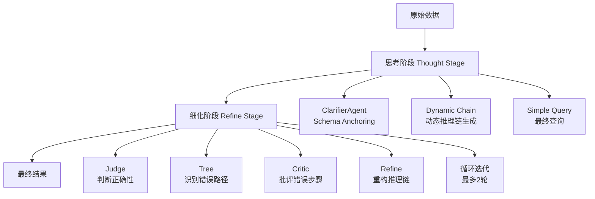
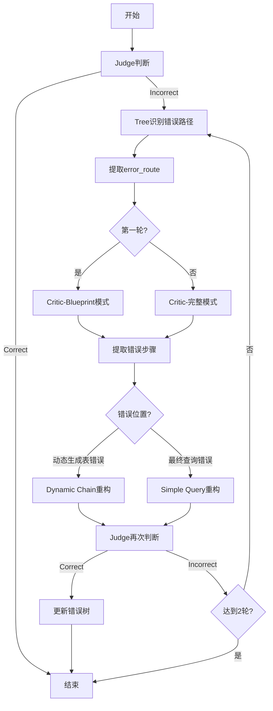
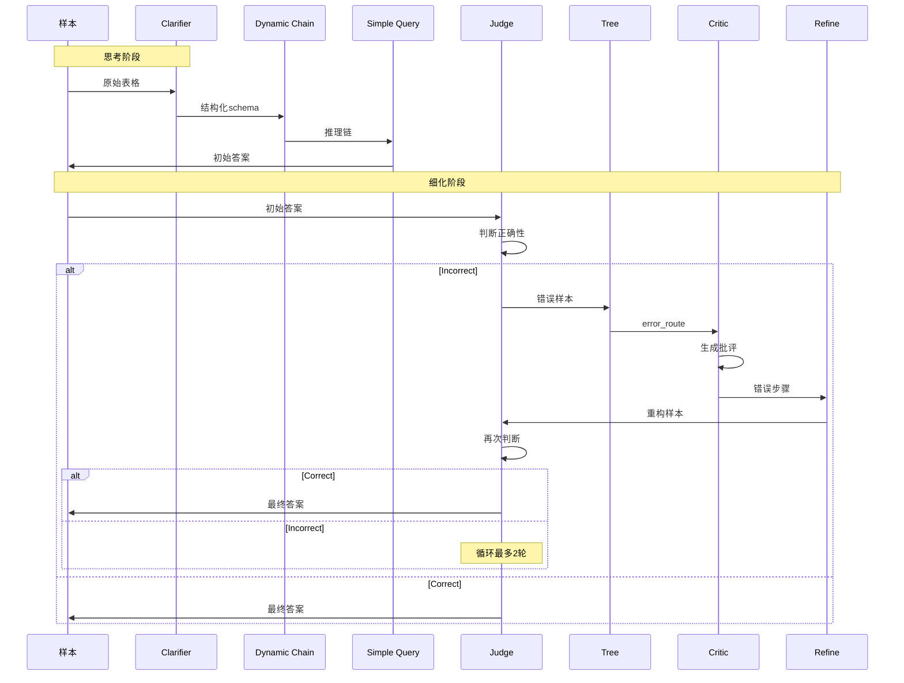

# Table-Critic Multi-Agent 实现分析

## 概述

Table-Critic项目实现了两种Multi-Agent协作方式：
1. **Multi-Agent框架**（use_multi_agent=True）
2. **原始方法**（use_multi_agent=False，当前实际使用）

本文档分析实际运行代码中的Multi-Agent实现方式（不包括agents目录下的文件）。

---

## 一、整体架构

### 1.1 两阶段处理流程



### 1.2 运行脚本

**TableQA任务** ([`run_QA.sh`](run_QA.sh:1)):
```bash
python thought/TableQA/main.py  # 思考阶段
python refine/TableQA/main_tree_based.py  # 细化阶段
```

**TableFV任务** ([`run_FV.sh`](run_FV.sh:1)):
```bash
python thought/TableFV/main.py  # 思考阶段
python refine/TableFV/main_tree_based.py  # 细化阶段
```

---

## 二、思考阶段（Thought Stage）

### 2.1 流程概述

思考阶段主要负责生成初始的推理链和答案。

**文件位置**：
- TableQA: [`thought/TableQA/main.py`](thought/TableQA/main.py:1)
- TableFV: [`thought/TableFV/main.py`](thought/TableFV/main.py:1)

### 2.2 核心步骤

#### 步骤1：ClarifierAgent - Schema Anchoring

**代码位置**：[`thought/TableQA/main.py:54-71`](thought/TableQA/main.py:54)

```python
clarifier = ClarifierAgent(llm=gpt_llm)
dataset = clarifier.clarify_batch(dataset)
```

**功能**：
- 提取表格的schema anchors
- 为后续推理提供结构化信息
- 保存clarifier结果到缓存目录

#### 步骤2：Dynamic Chain Execution

**代码位置**：[`thought/TableQA/main.py:73-83`](thought/TableQA/main.py:73)

```python
proc_samples, _ = dynamic_chain_exec_with_cache_mp(
    dataset,
    llm=gpt_llm,
    llm_options=gpt_llm.get_model_options(
        temperature=0.0, per_example_max_decode_steps=2048, per_example_top_p=1.0
    ),
    strategy="top",
    cache_dir=os.path.join(thought_results_dir, "cache"),
    n_proc=n_proc,
    chunk_size=chunk_size,
)
```

**功能**：
- 动态生成推理链
- 支持多种操作：add_column, select_row, select_column, group_column, sort_column
- 使用多进程并行处理
- 支持缓存机制

#### 步骤3：Simple Query

**代码位置**：[`thought/TableQA/main.py:84-103`](thought/TableQA/main.py:84)

```python
fixed_chain = [
    ("Simple query", simple_query, dict(use_demo=True), dict(...)),
]
final_result, _ = fixed_chain_exec_mp(gpt_llm, proc_samples, fixed_chain, n_proc=4, chunk_size=2)
```

**功能**：
- 基于推理链生成最终答案
- 使用CoT（Chain-of-Thought）推理

---

## 三、细化阶段（Refine Stage）

### 3.1 两种实现方式对比

**文件位置**：[`refine/TableQA/main_tree_based.py`](refine/TableQA/main_tree_based.py:1)

| 特性 | Multi-Agent框架 | 原始方法 |
|------|----------------|----------|
| 参数 | `use_multi_agent=True` | `use_multi_agent=False` |
| Agent类型 | 5个专门Agent | 函数式Agent |
| 协调器 | MultiAgentOrchestrator | 直接函数调用 |
| 争议处理 | DisputeHandler | 循环迭代 |
| 实际使用 | 未启用 | **已启用** |

### 3.2 原始方法（实际使用）

**代码位置**：[`refine/TableQA/main_tree_based.py:121-136`](refine/TableQA/main_tree_based.py:121)

```python
critic_tree_init(file_path="critic/TableQA/tools/few_shot_critic.json")
refine_list = judge_critic_refine_with_cache_mp(
    all_samples,
    llm=gpt_llm,
    llm_options=gpt_llm.get_model_options(
        temperature=0.0, per_example_max_decode_steps=2048, per_example_top_p=1.0
    ),
    strategy="top",
    cache_dir=cache_dir,
    n_proc=n_proc,
    chunk_size=chunk_size,
)
```

### 3.3 Judge-Critic-Refine循环流程

**核心函数**：[`judge_critic_refine_with_cache_mp`](refine/TableQA/utils/chain.py:923)

**单样本处理**：[`_judge_critic_refine_with_cache_mp_core`](refine/TableQA/utils/chain.py:955)



#### 详细步骤说明

**1. Judge阶段**

**函数**：[`judge_exec_one_sample`](critic/TableQA/tools/multiprocess.py:143)

```python
judge_sample = judge_exec_one_sample(sample, llm=llm, llm_options=llm_options)
judge = judge_sample['judge'].strip()
if judge == '[Correct]':
    proc_sample = judge_sample
```

**功能**：
- 判断预测答案是否正确
- 输出：`[Correct]` 或 `[Incorrect]`
- 使用few-shot learning

**Prompt构建**：[`get_cot_for_judge`](critic/TableQA/tools/get_info.py:159)

```python
cot = "Now, determine whether the given Prediction Answer is correct or incorrect..."
cot += "Original Table:\n/*\n" + table2string(sample['table_text']) + "\n*/\n\n"
cot += "Question: \n" + sample['statement'] + "\n\n"
cot += "Prediction Answer: \n" + table_log[-1]["cotable_result"].lower() + "\n\n"
cot += "Explanation:"
```

**2. Tree阶段**

**函数**：[`tree_exec_one_sample`](critic/TableQA/tools/multiprocess.py:106)

```python
tree_sample = tree_exec_one_sample(judge_sample, llm=llm, llm_options=llm_options)
routes = re.findall(r'\((.*?)\)', tree_sample['tree'])
if routes:
    error_route = routes[0]
else:
    error_route = "random"
```

**功能**：
- 识别错误类型和错误路径
- 使用错误树（Error Tree）进行分类
- 输出：error_route（如 "sub-table error -> row error"）

**Prompt构建**：[`get_cot_for_tree`](critic/TableQA/tools/get_info.py:171)

```python
cot = "Now, identify which step within the reasoning process is incorrect..."
cot += "<error tree>\n" + json.dumps(modified_error_tree, indent=4, ensure_ascii=False)
cot += "Original Table:\n/*\n" + table2string(sample['table_text']) + "\n*/\n\n"
cot += "Question: \n" + sample['statement'] + "\n\n"
cot += "Reasoning Steps:\n..."
cot += "Prediction Answer: \n" + table_log[-1]["cotable_result"].lower() + "\n\n"
cot += "Analysis:"
```

**错误树结构**：[`few_shot_tree.json`](critic/TableQA/tools/few_shot_tree.json:1)

```json
{
    "sub-table error": {
        "row error": "<END>",
        "column error": "<END>"
    },
    "final query error": "<END>"
}
```

**3. Critic阶段**

**函数**：[`critic_exec_one_sample`](critic/TableQA/tools/multiprocess.py:61)

```python
# 第一轮：Blueprint模式
if loop_count == 0:
    critic_sample = critic_exec_one_sample(
        tree_sample, error_route, llm=llm, llm_options=llm_options, blueprint_only=True
    )
# 第二轮：完整模式
else:
    critic_sample = critic_exec_one_sample(
        tree_sample, error_route, llm=llm, llm_options=llm_options, blueprint_only=False
    )
```

**功能**：
- 批评推理过程
- 指出具体的错误步骤
- 第一轮使用blueprint模式（只提供错误摘要）
- 第二轮使用完整信息

**Blueprint模式**：[`get_critic_blueprint`](critic/TableQA/tools/get_info.py:255)

```python
blueprint_text = "\nHere are some error blueprints.\n\n"
for idx, shot in enumerate(selected_few_shot):
    if isinstance(shot, dict) and 'blueprint' in shot:
        blueprint_text += f"Example {idx+1}:\nBlueprint: {shot['blueprint']}\n\n\n"
```

**完整模式**：[`get_critic_few_shot`](critic/TableQA/tools/get_info.py:240)

```python
few_shot = "\nHere are some examples.\n\n"
for idx, shot in enumerate(selected_few_shot):
    few_shot += f"Example {idx+1}:\n" + shot + "\n\n\n"
```

**Prompt构建**：[`get_cot_for_critic`](critic/TableQA/tools/get_info.py:99)

```python
cot = "Now, determine which step of the table reasoning is incorrect..."
cot += "Original Table:\n/*\n" + table2string(sample['table_text']) + "\n*/\n\n"
cot += "Question: \n" + sample['statement'] + "\n\n"
cot += "Reasoning Steps:\n..."
cot += "Prediction Answer: \n" + table_log[-1]["cotable_result"].lower() + "\n\n"
cot += "Critique:"
```

**4. Refine阶段**

**函数**：[`dynamic_chain_exec_one_sample`](refine/TableQA/utils/chain.py:635)

```python
incorrect_step, max_step = return_incorrect_max_step(critic_sample)

if incorrect_step != max_step:  # 错误发生在动态生成表时
    refine_chain_sample = dynamic_chain_exec_one_sample(
        critic_sample, llm=llm, incorrect_step=incorrect_step, max_step=max_step, 
        llm_options=llm_options, strategy=strategy
    )
    table_info = get_table_info(refine_chain_sample, skip_op=[], first_n_op=None)
    refine_sample = simple_query_cot_original(refine_chain_sample, table_info, llm, ...)
else:  # 错误发生在最终查询时
    wo_query_sample = copy.deepcopy(critic_sample)
    wo_query_sample['chain'] = wo_query_sample['chain'][:-1]
    table_info = get_table_info(wo_query_sample, skip_op=[], first_n_op=None)
    refine_sample = simple_query_with_critic(critic_sample, table_info, llm, ...)
```

**功能**：
- 根据critic指出的错误步骤重构推理链
- 支持两种错误类型：
  - 动态生成表错误：重新生成从错误步骤开始的推理链
  - 最终查询错误：重新生成最终查询

**5. 循环迭代**

```python
loop_count = 0
while(loop_count < 2):
    # Judge -> Tree -> Critic -> Refine
    ...
    judge_sample = judge_exec_one_sample(refine_sample, llm=llm, llm_options=llm_options)
    judge = judge_sample['judge'].strip()
    if judge == '[Correct]':
        update_error_tree(critic_sample, error_route, ...)
        break
    loop_count += 1
```

**特点**：
- 最多迭代2轮
- 如果正确，更新错误树
- 如果达到最大轮数仍未正确，停止迭代

---

## 四、Multi-Agent协作机制总结

### 4.1 Agent角色定义

| Agent | 功能 | 输入 | 输出 |
|-------|------|------|------|
| **Clarifier** | Schema Anchoring | 原始表格 | 结构化schema |
| **Dynamic Chain** | 动态推理链生成 | 表格+问题 | 推理链 |
| **Simple Query** | 最终答案生成 | 推理链 | 答案 |
| **Judge** | 判断正确性 | 样本 | [Correct]/[Incorrect] |
| **Tree** | 识别错误路径 | 样本 | error_route |
| **Critic** | 批评错误步骤 | 样本+error_route | 错误步骤+批评 |
| **Refine** | 重构推理链 | 样本+错误步骤 | 新推理链 |

### 4.2 协作流程



### 4.3 关键技术特点

#### 1. Few-Shot Learning

所有Agent都使用few-shot learning来提高性能：

- **Judge**: [`get_judge_few_shot`](critic/TableQA/tools/get_info.py:310)
- **Tree**: [`get_tree_few_shot`](critic/TableQA/tools/get_info.py:279)
- **Critic**: [`get_critic_few_shot`](critic/TableQA/tools/get_info.py:240) / [`get_critic_blueprint`](critic/TableQA/tools/get_info.py:255)

#### 2. 错误树（Error Tree）

- 用于分类和定位错误类型
- 结构化表示错误路径
- 支持动态更新：[`update_error_tree`](critic/TableQA/tools/update_tree.py:1)

#### 3. Blueprint模式

- 第一轮使用blueprint模式，只提供错误摘要
- 第二轮使用完整信息
- 减少计算成本，提高效率

#### 4. 缓存机制

- 所有中间结果都缓存到磁盘
- 避免重复计算
- 支持断点续传

#### 5. 多进程并行

- 使用Python multiprocessing进行并行处理
- 提高处理效率
- 支持chunk_size参数优化

#### 6. 循环迭代

- 最多迭代2轮
- 逐步改进推理链
- 避免无限循环

---

## 五、数据流

### 5.1 样本数据结构

```python
sample = {
    'id': str,                    # 样本ID
    'table_text': dict,          # 表格数据
    'statement': str,             # 问题
    'chain': list,                # 推理链
    'clarifier': dict,            # Clarifier结果
    'cotable_result': str,        # 预测答案
    'judge': str,                 # Judge判断
    'tree': str,                 # Tree识别的错误路径
    'critique': str,             # Critic批评
    'conclusion': str,           # Critic结论
    'max_step': int,             # 最大步骤数
    # ... 其他字段
}
```

### 5.2 推理链结构

```python
chain = [
    {
        'operation_name': 'f_add_column',
        'parameter_and_conf': [('column_name', confidence)],
        'thought': 'reasoning text'
    },
    {
        'operation_name': 'f_select_row',
        'parameter_and_conf': [('row indices', confidence)],
        'thought': 'reasoning text'
    },
    # ... 更多操作
]
```

---

## 六、Multi-Agent框架（未启用）

虽然代码中实现了完整的Multi-Agent框架（见agents目录），但实际运行时并未启用。

### 6.1 框架结构

**Agent类型**（[`agents/multi_agent_framework.py:30-38`](agents/multi_agent_framework.py:30)）：
- CLARIFIER
- REASONER
- JUDGE
- CRITIC
- REFINER
- VALIDATOR
- CURATOR

**消息类型**（[`agents/multi_agent_framework.py:41-49`](agents/multi_agent_framework.py:41)）：
- REQUEST
- RESPONSE
- CRITIQUE
- FEEDBACK
- DISPUTE
- RESOLUTION
- FINAL_JUDGMENT

### 6.2 协调器

**MultiAgentOrchestrator**（[`agents/multi_agent_framework.py:148`](agents/multi_agent_framework.py:148)）：
- 管理Agent注册
- 协调Agent执行顺序
- 处理争议解决
- 支持游戏理论策略

### 6.3 争议处理

**DisputeHandler**：
- 处理Agent之间的争议
- 实现争议解决机制
- 支持多轮争议解决

---

## 七、总结

### 7.1 实际使用的Multi-Agent实现

Table-Critic项目实际使用的是**函数式Multi-Agent**实现，而非面向对象的Multi-Agent框架。这种实现方式具有以下特点：

**优点**：
1. **简单直接**：函数调用清晰，易于理解
2. **高效**：避免了面向对象的开销
3. **灵活**：易于修改和扩展
4. **可并行**：支持多进程并行处理

**缺点**：
1. **缺乏统一接口**：每个Agent的实现方式不同
2. **难以复用**：Agent之间的耦合度较高
3. **难以扩展**：添加新Agent需要修改多处代码

### 7.2 核心创新点

1. **Judge-Critic-Refine循环**：通过迭代改进推理链
2. **错误树机制**：结构化错误分类和定位
3. **Blueprint模式**：渐进式错误修复
4. **Few-Shot Learning**：提高Agent性能
5. **缓存机制**：避免重复计算

### 7.3 与传统方法的区别

| 特性 | 传统方法 | Table-Critic |
|------|----------|--------------|
| 错误处理 | 单次推理 | 迭代改进 |
| 错误定位 | 无 | 错误树+Blueprint |
| 协作方式 | 无 | Multi-Agent循环 |
| 学习方式 | Zero-shot | Few-shot |
| 缓存 | 无 | 完整缓存机制 |

---

## 八、相关文件清单

### 8.1 思考阶段

- [`thought/TableQA/main.py`](thought/TableQA/main.py:1) - TableQA思考阶段主程序
- [`thought/TableFV/main.py`](thought/TableFV/main.py:1) - TableFV思考阶段主程序
- [`thought/TableQA/utils/chain.py`](thought/TableQA/utils/chain.py:1) - 动态链执行

### 8.2 细化阶段

- [`refine/TableQA/main_tree_based.py`](refine/TableQA/main_tree_based.py:1) - TableQA细化阶段主程序
- [`refine/TableFV/main_tree_based.py`](refine/TableFV/main_tree_based.py:1) - TableFV细化阶段主程序
- [`refine/TableQA/utils/chain.py`](refine/TableQA/utils/chain.py:1) - Judge-Critic-Refine循环

### 8.3 Critic工具

- [`critic/TableQA/tools/multiprocess.py`](critic/TableQA/tools/multiprocess.py:1) - Agent执行函数
- [`critic/TableQA/tools/get_info.py`](critic/TableQA/tools/get_info.py:1) - Prompt构建
- [`critic/TableQA/tools/update_tree.py`](critic/TableQA/tools/update_tree.py:1) - 错误树更新
- [`critic/TableQA/tools/few_shot_critic.json`](critic/TableQA/tools/few_shot_critic.json:1) - Critic few-shot示例
- [`critic/TableQA/tools/few_shot_tree.json`](critic/TableQA/tools/few_shot_tree.json:1) - Tree few-shot示例
- [`critic/TableQA/tools/few_shot_judge.json`](critic/TableQA/tools/few_shot_judge.json:1) - Judge few-shot示例

### 8.4 运行脚本

- [`run_QA.sh`](run_QA.sh:1) - TableQA运行脚本
- [`run_FV.sh`](run_FV.sh:1) - TableFV运行脚本

---

## 九、附录

### 9.1 错误树示例

```json
{
    "sub-table error": {
        "row error": {
            "wrong row selection": "<END>",
            "missing row": "<END>",
            "extra row": "<END>"
        },
        "column error": {
            "wrong column selection": "<END>",
            "missing column": "<END>",
            "extra column": "<END>"
        },
        "group error": "<END>",
        "sort error": "<END>"
    },
    "final query error": {
        "wrong answer": "<END>",
        "incomplete answer": "<END>",
        "format error": "<END>"
    }
}
```

### 9.2 Blueprint示例

```json
{
    "blueprint": "Error occurred in step 3: wrong row selection. The model selected rows 1, 2, 3 but should have selected rows 2, 4, 5.",
    "full_example": "Complete example with table, question, reasoning steps, and critique..."
}
```

### 9.3 执行流程示例

```
1. Clarifier: Extract schema anchors from table
2. Dynamic Chain: Generate reasoning chain
   - Step 1: f_add_column(year)
   - Step 2: f_select_row(row 1, row 2)
   - Step 3: f_select_column(year, value)
3. Simple Query: Generate answer "2020"
4. Judge: [Incorrect]
5. Tree: sub-table error -> row error
6. Critic (Round 1 - Blueprint): Error in step 2: wrong row selection
7. Refine: Re-select rows 2, 4
8. Simple Query: Generate answer "2018"
9. Judge: [Correct]
10. Update error tree: Mark this error pattern as resolved
```

---

**文档版本**: 1.0  
**最后更新**: 2026-03-12  
**分析范围**: 实际运行代码（不包括agents目录）
