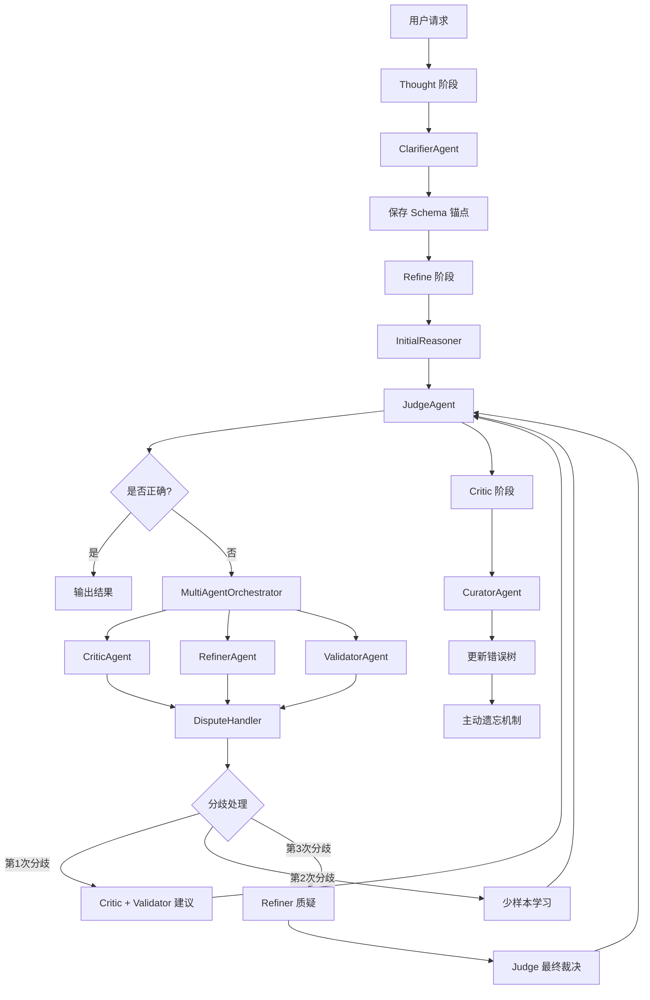

# 方案一：创建新的 Agents 类实现计划

## 方案概述

本方案基于 TODO.md 的设计意图，创建独立的 Agents 类，实现清晰的架构分离和模块化设计。

---

## 架构设计

### 整体架构



### 目录结构

```
Table-Critic/
├── agents/                          # 新增：Agents 核心目录
│   ├── __init__.py
│   ├── base_agent.py                # 基础 Agent 类
│   ├── clarifier_agent.py            # ClarifierAgent
│   ├── initial_reasoner.py          # InitialReasoner
│   ├── judge_agent.py               # JudgeAgent
│   ├── critic_agent.py              # CriticAgent
│   ├── refiner_agent.py             # RefinerAgent
│   ├── validator_agent.py            # ValidatorAgent
│   ├── curator_agent.py             # CuratorAgent
│   ├── multi_agent_framework.py      # MultiAgentOrchestrator
│   └── dispute_handler.py           # DisputeHandler
├── memory/                          # 新增：记忆管理目录
│   ├── __init__.py
│   ├── active_forgetting.py          # 主动遗忘机制
│   └── memory_manager.py            # 记忆管理器
├── thought/
│   └── TableQA/
│       ├── main.py                  # 修改：使用 ClarifierAgent
│       └── ...
├── refine/
│   └── TableQA/
│       ├── main_tree_based.py        # 修改：使用多 Agent 框架
│       └── ...
├── critic/
│   └── TableQA/
│       ├── main.py                  # 修改：使用 CuratorAgent
│       └── tools/
│           └── update_tree.py       # 修改：集成 CuratorAgent
└── ...
```

---

## 实现步骤

### 第一阶段：创建基础架构

#### 1.1 创建基础 Agent 类

**文件**：`agents/base_agent.py`

**功能**：
- 定义 Agent 基类
- 提供通用的 LLM 调用接口
- 实现日志记录功能
- 提供缓存机制

**关键方法**：
```python
class BaseAgent:
    def __init__(self, llm, cache_dir=None)
    def execute(self, sample, **kwargs)
    def _generate_prompt(self, template, **kwargs)
    def _call_llm(self, prompt, options)
    def _save_cache(self, key, value)
    def _load_cache(self, key)
```

#### 1.2 创建多智能体框架

**文件**：`agents/multi_agent_framework.py`

**功能**：
- 实现 MultiAgentOrchestrator
- 管理 Agent 注册和调度
- 实现 Agent 间通信协议
- 提供任务分发机制

**关键方法**：
```python
class MultiAgentOrchestrator:
    def __init__(self, llm)
    def register_agent(self, agent)
    def execute_task(self, task, agents)
    def route_to_agent(self, task, agent_name)
    def broadcast_message(self, message, exclude=[])
```

---

### 第二阶段：实现 Thought 阶段 Agents

#### 2.1 创建 ClarifierAgent

**文件**：`agents/clarifier_agent.py`

**功能**：
- 提取表格列名（Header）
- 提取关键实体（Entity）
- 提取数值单位（Unit）
- 生成轻量化关键词典

**关键方法**：
```python
class ClarifierAgent(BaseAgent):
    def clarify_sample(self, sample)
    def extract_headers(self, table_text)
    def extract_entities(self, statement, table_text)
    def extract_units(self, table_text)
    def create_keyword_dict(self, headers, entities, units)
    def clarify_batch(self, dataset)
```

**Prompt 设计**：
```
你是一个表格分析专家。请分析以下表格，提取关键信息：

表格：
{table_text}

问题：
{statement}

请提取以下信息：
1. 列名（Header）：表格中所有列的名称
2. 关键实体（Entity）：问题中提到的关键实体
3. 数值单位（Unit）：表格中数值列的单位

以 JSON 格式返回结果。
```

#### 2.2 修改 Thought 阶段主文件

**文件**：`thought/TableQA/main.py`

**修改内容**：
- 导入 ClarifierAgent
- 在推理前调用 ClarifierAgent
- 保存 Clarifier 结果到 `results/{model}/thought/clarifier/`

**关键代码**：
```python
from agents.clarifier_agent import ClarifierAgent

# 初始化 ClarifierAgent
clarifier = ClarifierAgent(llm=gpt_llm)
dataset = clarifier.clarify_batch(dataset)

# 保存 Clarifier 结果
clarifier_dir = os.path.join(thought_results_dir, "clarifier")
os.makedirs(clarifier_dir, exist_ok=True)
for sample in dataset:
    sample_id = sample.get('id', 'unknown')
    clarifier_path = os.path.join(clarifier_dir, f'case_dict_{sample_id}.pkl')
    pickle.dump(sample['clarifier'], open(clarifier_path, "wb"))
```

---

### 第三阶段：实现 Refine 阶段 Agents

#### 3.1 创建 InitialReasoner

**文件**：`agents/initial_reasoner.py`

**功能**：
- 执行初始推理
- 生成思维链（Chain of Thought）
- 返回推理结果

**关键方法**：
```python
class InitialReasoner(BaseAgent):
    def reason_sample(self, sample)
    def generate_chain(self, sample)
    def execute_operations(self, sample, chain)
```

#### 3.2 创建 JudgeAgent

**文件**：`agents/judge_agent.py`

**功能**：
- 判断回答是否正确
- 返回 [Correct] 或 [Incorrect]
- 参照 Table-Critic 的 Judge 实现

**关键方法**：
```python
class JudgeAgent(BaseAgent):
    def judge_sample(self, sample, task_type="TableQA")
    def _generate_judge_prompt(self, sample)
    def _parse_judge_result(self, response)
```

**Prompt 设计**：
```
你是一个表格推理判官。请判断以下推理结果是否正确。

表格：
{table_text}

问题：
{statement}

推理步骤：
{chain}

最终答案：
{answer}

请判断推理是否正确，返回 [Correct] 或 [Incorrect]。
```

#### 3.3 创建 CriticAgent

**文件**：`agents/critic_agent.py`

**功能**：
- 基于记忆库检索 Blueprint
- 下达纠偏指令
- 实现两阶段 Prompt 策略：
  - 第一次：只引入 Blueprint
  - 第二次：引入原文作为少样本学习

**关键方法**：
```python
class CriticAgent(BaseAgent):
    def critique_sample(self, sample, error_route, blueprint_only=False)
    def _retrieve_blueprint(self, sample, error_route)
    def _generate_critic_prompt(self, sample, blueprint, blueprint_only)
    def _parse_critique(self, response)
```

**Prompt 设计（第一次）**：
```
你是一个表格推理导师。以下是一个常见的错误模式：

错误模式摘要：
{blueprint}

请基于这个错误模式，检查以下推理：

表格：
{table_text}

问题：
{statement}

推理步骤：
{chain}

请指出推理中的错误，并提供改进建议。
```

**Prompt 设计（第二次）**：
```
你是一个表格推理导师。以下是一个常见的错误模式及示例：

错误模式摘要：
{blueprint}

示例：
{few_shot_examples}

请基于这个错误模式和示例，检查以下推理：

表格：
{table_text}

问题：
{statement}

推理步骤：
{chain}

请指出推理中的错误，并提供改进建议。
```

#### 3.4 创建 RefinerAgent

**文件**：`agents/refiner_agent.py`

**功能**：
- 基于 Critic 的建议修正推理路径
- 实现推理路径修正逻辑
- 保留原 Critic 的错误识别和重试环节

**关键方法**：
```python
class RefinerAgent(BaseAgent):
    def refine_sample(self, sample, critique)
    def _identify_error_step(self, sample, critique)
    def _regenerate_chain(self, sample, error_step, critique)
    def _execute_refined_chain(self, sample, refined_chain)
```

#### 3.5 创建 ValidatorAgent

**文件**：`agents/validator_agent.py`

**功能**：
- 基于表格事实进行审计
- 实现数值与单元格定位的硬性审计
- 实现严格的逻辑校验模版

**关键方法**：
```python
class ValidatorAgent(BaseAgent):
    def validate_sample(self, sample, clarifier_result)
    def _validate_numerical_calculation(self, sample, clarifier_result)
    def _validate_cell_reference(self, sample, clarifier_result)
    def _validate_logic(self, sample, clarifier_result)
```

**Prompt 设计**：
```
你是一个表格推理审计员。请严格审计以下推理：

表格：
{table_text}

关键信息（来自 Clarifier）：
{clarifier_info}

问题：
{statement}

推理步骤：
{chain}

最终答案：
{answer}

请检查：
1. 数值计算是否正确
2. 单元格引用是否准确
3. 逻辑推理是否严密

返回审计结果：[Valid] 或 [Invalid]，并说明原因。
```

#### 3.6 创建 DisputeHandler

**文件**：`agents/dispute_handler.py`

**功能**：
- 实现三次分歧处理机制
- 第一次：Critic 带 Validator 建议重试
- 第二次：加入少样本案例学习
- 第三次：触发 Refiner 质疑，交 Judge 最终裁决
- 实现"无法修正"标记机制

**关键方法**：
```python
class DisputeHandler:
    def __init__(self, critic, refiner, validator, judge)
    def resolve_dispute(self, sample, error_route)
    def _handle_first_dispute(self, sample)
    def _handle_second_dispute(self, sample, error_route)
    def _handle_third_dispute(self, sample)
    def _mark_unfixable(self, sample)
```

**分歧处理流程**：
```python
def resolve_dispute(self, sample, error_route):
    dispute_count = 0
    max_disputes = 3
    
    while dispute_count < max_disputes:
        if dispute_count == 0:
            # 第一次分歧：Critic + Validator
            sample = self._handle_first_dispute(sample)
        elif dispute_count == 1:
            # 第二次分歧：少样本学习
            sample = self._handle_second_dispute(sample, error_route)
        elif dispute_count == 2:
            # 第三次分歧：Refiner 质疑 + Judge 裁决
            sample = self._handle_third_dispute(sample)
        
        # Judge 判断
        judge_result = self.judge.judge_sample(sample)
        if judge_result['judge'] == '[Correct]':
            break
        
        dispute_count += 1
    
    if dispute_count >= max_disputes:
        sample = self._mark_unfixable(sample)
    
    return sample
```

#### 3.7 修改 Refine 阶段主文件

**文件**：`refine/TableQA/main_tree_based.py`

**修改内容**：
- 导入所有 Agents
- 初始化 MultiAgentOrchestrator
- 注册所有 Agents
- 使用 DisputeHandler 处理分歧
- 保存思维链到 `data/results/{model}/refiner/cache/`

**关键代码**：
```python
from agents import (
    InitialReasoner,
    JudgeAgent,
    CriticAgent,
    RefinerAgent,
    ValidatorAgent,
    MultiAgentOrchestrator,
    DisputeHandler
)

# 初始化 Agents
reasoner = InitialReasoner(llm=gpt_llm)
judge = JudgeAgent(llm=gpt_llm)
critic = CriticAgent(llm=gpt_llm)
refiner = RefinerAgent(llm=gpt_llm)
validator = ValidatorAgent(llm=gpt_llm)

# 创建 Orchestrator
orchestrator = MultiAgentOrchestrator(llm=gpt_llm)
orchestrator.register_agent(reasoner)
orchestrator.register_agent(judge)
orchestrator.register_agent(critic)
orchestrator.register_agent(refiner)
orchestrator.register_agent(validator)

# 创建 DisputeHandler
dispute_handler = DisputeHandler(critic, refiner, validator, judge)

# 处理样本
for sample in all_samples:
    # 保存原始链
    original_chain = copy.deepcopy(sample.get('chain', []))
    
    # Judge 判断
    judge_sample = judge.judge_sample(sample, task_type="TableQA")
    if judge_sample.get('judge') == '[Correct]':
        refined_samples.append(judge_sample)
        continue
    
    # 分歧处理
    refined_sample, dispute_history = dispute_handler.resolve_dispute(
        judge_sample,
        error_route='random'
    )
    
    # 保存思维链
    save_data = {
        'sample_id': sample_id,
        'original_chain': original_chain,
        'final_chain': refined_sample.get('chain', []),
        'dispute_history': dispute_history,
        'original_conclusion': '[Incorrect]',
        'final_conclusion': refined_sample.get('judge', '[Incorrect]')
    }
    cache_path = os.path.join(cache_dir, f'case_{sample_id}.pkl')
    pickle.dump(save_data, open(cache_path, 'wb'))
```

---

### 第四阶段：实现 Critic 阶段 Agents

#### 4.1 创建 CuratorAgent

**文件**：`agents/curator_agent.py`

**功能**：
- 将原有的 Curator 作为基础
- 实现摘要化（Summarization）
- 提取新的错误模式
- 生成 Blueprint
- 将整个案例作为叶子节点保存

**关键方法**：
```python
class CuratorAgent(BaseAgent):
    def curate_sample(self, sample, error_route)
    def _summarize_error(self, sample)
    def _generate_blueprint(self, error_summary)
    def _save_as_leaf_node(self, sample, blueprint)
    def _update_confidence_score(self, sample, success)
```

**Prompt 设计**：
```
你是一个档案管理员。请总结以下错误案例：

表格：
{table_text}

问题：
{statement}

推理步骤：
{chain}

Critique：
{critique}

请生成一个简洁的错误模式摘要（Blueprint），概括这个错误的本质。
```

#### 4.2 扩展模板树数据结构

**文件**：`critic/TableQA/tools/update_tree.py`

**修改内容**：
- 增加字段：`blueprint`（错误模式摘要）
- 增加字段：`confidence_score`（用于主动遗忘）
- 保持原有树状结构

**修改后的数据结构**：
```python
template_dict = {
    "blueprint": blueprint,           # 新增
    "confidence_score": confidence_score,  # 新增
    "content": critic_template
}
```

#### 4.3 创建主动遗忘机制

**文件**：`memory/active_forgetting.py`

**功能**：
- 为每个 Case 维护 `confidence_score`
- 成功引导修复 → 权重 +1
- 长期低权重的 Case 剔除机制
- 为新错误腾出空间

**关键方法**：
```python
class ActiveForgetting:
    def __init__(self, min_confidence=0.1, max_cases=1000)
    def update_confidence(self, case_id, success)
    def prune_low_confidence_cases(self, error_tree)
    def get_case_count(self, error_tree)
    def _calculate_case_priority(self, case)
```

**权重更新策略**：
```python
def update_confidence(self, case_id, success):
    if success:
        # 成功引导修复，权重增加
        self.confidence_scores[case_id] += 1
    else:
        # 未能引导修复，权重降低
        self.confidence_scores[case_id] *= 0.9
    
    # 确保权重在合理范围内
    self.confidence_scores[case_id] = max(
        0.1,
        min(10.0, self.confidence_scores[case_id])
    )
```

#### 4.4 修改记忆更新逻辑

**文件**：`critic/TableQA/tools/update_tree.py`

**修改内容**：
- 集成 CuratorAgent 的 Blueprint 生成
- 更新 confidence_score
- 触发主动遗忘机制

**关键代码**：
```python
from agents.curator_agent import CuratorAgent
from memory.active_forgetting import ActiveForgetting

# 初始化
curator = CuratorAgent(llm=llm)
active_forgetting = ActiveForgetting()

# 更新错误树
def update_error_tree(sample, error_route, error_tree_json, llm, llm_options, lock):
    # 使用 CuratorAgent 生成 Blueprint
    blueprint = curator._generate_blueprint(sample["critique"])
    
    # 更新 confidence_score
    confidence_score = sample.get('confidence_score', 1.0)
    
    # 保存模板
    template_dict = {
        "blueprint": blueprint,
        "confidence_score": confidence_score,
        "content": critic_template
    }
    
    # 触发主动遗忘
    with lock:
        with open(error_tree_json, 'r') as f:
            few_shot_dict = json.load(f)
        
        # 更新树结构
        # ... (现有逻辑)
        
        # 主动遗忘
        active_forgetting.prune_low_confidence_cases(few_shot_dict)
        
        with open(error_tree_json, 'w') as f:
            json.dump(few_shot_dict, f, indent=4)
```

#### 4.5 修改 Critic 阶段主文件

**文件**：`critic/TableQA/main.py`

**修改内容**：
- 导入 CuratorAgent
- 在处理完成后调用 CuratorAgent
- 更新错误树

**关键代码**：
```python
from agents.curator_agent import CuratorAgent

# 初始化 CuratorAgent
curator = CuratorAgent(llm=gpt_llm)

# 处理样本
for sample in all_samples:
    # ... (现有逻辑)
    
    # 使用 CuratorAgent 更新记忆
    curator.curate_sample(sample, error_route)
```

---

### 第五阶段：创建使用脚本

#### 5.1 创建运行脚本

**文件**：`run_0312_arch.sh`

**功能**：
- 按顺序执行三个阶段
- 使用 SiliconFlow 的 Qwen/Qwen3-32B 模型
- 从 siliconflow.txt 读取 API key

**脚本内容**：
```bash
#!/bin/bash

# 读取 API key
API_KEY=$(cat siliconflow.txt)
BASE_URL="https://api.siliconflow.cn/v1"
MODEL="Qwen/Qwen3-32B"

# 设置结果目录
MODEL_DIR="results/qwen3-32b"
THOUGHT_DIR="$MODEL_DIR/thought"
REFINE_DIR="$MODEL_DIR/refine"
CRITIC_DIR="$MODEL_DIR/critic"

# 第一阶段：Thought
echo "=== Stage 1: Thought ==="
python thought/TableQA/main.py \
    --dataset_path "thought/TableQA/data/wikitq/test_lower.jsonl" \
    --thought_results_dir "$THOUGHT_DIR" \
    --base_url "$BASE_URL" \
    --openai_api_key "$API_KEY" \
    --model_name "$MODEL" \
    --first_n -1 \
    --n_proc 8 \
    --chunk_size 4

# 第二阶段：Refine
echo "=== Stage 2: Refine ==="
python refine/TableQA/main_tree_based.py \
    --thought_results_dir "$THOUGHT_DIR" \
    --refine_results_dir "$REFINE_DIR" \
    --base_url "$BASE_URL" \
    --openai_api_key "$API_KEY" \
    --model_name "$MODEL" \
    --first_n -1 \
    --n_proc 10 \
    --chunk_size 5 \
    --use_multi_agent

# 第三阶段：Critic
echo "=== Stage 3: Critic ==="
python critic/TableQA/main.py \
    --thought_results_dir "$THOUGHT_DIR" \
    --critic_results_dir "$CRITIC_DIR" \
    --base_url "$BASE_URL" \
    --openai_api_key "$API_KEY" \
    --model_name "$MODEL" \
    --first_n -1 \
    --n_proc 1 \
    --chunk_size 1

echo "=== All stages completed ==="
```

---

## 优点分析

1. **清晰的架构分离**：每个 Agent 有独立的职责，符合单一职责原则
2. **易于测试**：每个 Agent 可以独立进行单元测试
3. **可扩展性强**：新增 Agent 不影响现有代码
4. **符合设计意图**：完全遵循 TODO.md 的设计
5. **代码复用性好**：可以在不同阶段复用相同的 Agent
6. **符合现代架构模式**：Agent 模式是 AI 系统的常见架构
7. **易于维护**：代码结构清晰，便于后续维护
8. **便于协作**：不同开发者可以独立开发不同的 Agent

---

## 缺点分析

1. **需要创建大量新文件**：需要创建 agents 和 memory 目录及多个 Agent 文件
2. **代码量较大**：每个 Agent 都需要完整的实现
3. **可能存在重复代码**：多个 Agent 可能有相似的功能
4. **需要设计 Agent 间通信机制**：增加了系统复杂度
5. **调试难度增加**：需要追踪多个 Agent 之间的交互
6. **学习曲线较陡**：新开发者需要理解 Agent 框架
7. **初期开发时间较长**：需要搭建完整的 Agent 框架

---

## 风险评估

| 风险 | 概率 | 影响 | 缓解措施 |
|------|------|------|----------|
| Agent 间通信复杂度高 | 中 | 高 | 设计清晰的通信协议，提供文档 |
| 性能开销较大 | 中 | 中 | 实现缓存机制，优化 LLM 调用 |
| 代码重复 | 高 | 低 | 提取公共功能到 BaseAgent |
| 调试困难 | 中 | 中 | 提供详细的日志和追踪机制 |
| 开发周期长 | 中 | 高 | 分阶段实现，优先实现核心功能 |

---

## 总结

方案一通过创建独立的 Agents 类，实现了清晰的架构分离和模块化设计。虽然需要创建大量新文件和代码，但长期来看，这种架构更易于维护、测试和扩展。完全符合 TODO.md 的设计意图，是一个面向未来的架构选择。
