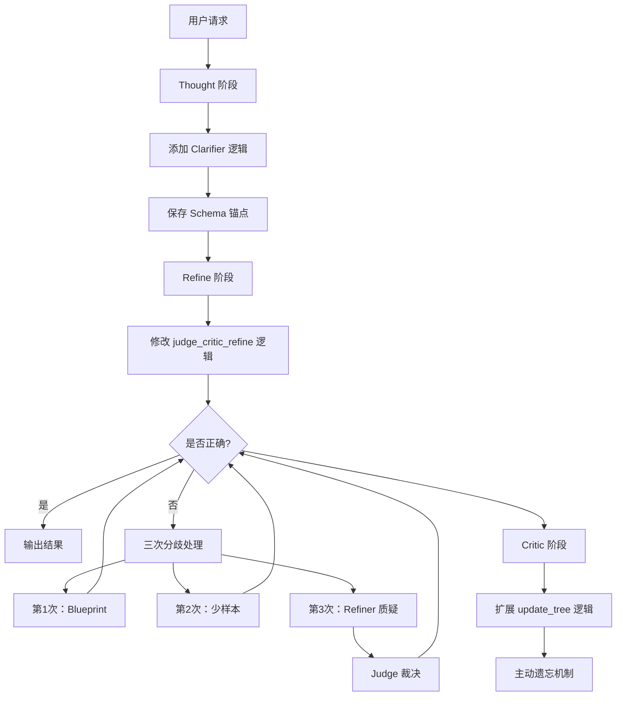

# 方案二：在现有架构上修改实现计划

## 方案概述

本方案基于现有代码架构，通过修改现有文件来实现 TODO.md 中的功能，最小化新文件的创建，充分利用现有的链式处理逻辑。

---

## 架构设计

### 整体架构



### 目录结构

```
Table-Critic/
├── thought/
│   └── TableQA/
│       ├── main.py                  # 修改：添加 Clarifier 逻辑
│       ├── utils/
│       │   └── clarifier.py        # 新增：Clarifier 工具函数
│       └── ...
├── refine/
│   └── TableQA/
│       ├── main_tree_based.py        # 修改：实现三次分歧处理
│       ├── utils/
│       │   ├── chain.py            # 修改：扩展分歧处理逻辑
│       │   └── validator.py       # 新增：Validator 工具函数
│       └── ...
├── critic/
│   └── TableQA/
│       ├── main.py                  # 修改：集成 Curator 逻辑
│       └── tools/
│           ├── update_tree.py       # 修改：扩展 Blueprint 和主动遗忘
│           └── curator.py          # 新增：Curator 工具函数
├── memory/                          # 新增：仅包含主动遗忘模块
│   ├── __init__.py
│   └── active_forgetting.py
└── run_0312_arch.sh              # 新增：运行脚本
```

---

## 实现步骤

### 第一阶段：实现 Thought 阶段 Clarifier

#### 1.1 创建 Clarifier 工具函数

**文件**：`thought/TableQA/utils/clarifier.py`

**功能**：
- 提取表格列名（Header）
- 提取关键实体（Entity）
- 提取数值单位（Unit）
- 生成轻量化关键词典

**关键函数**：
```python
def extract_clarifier_info(sample, llm, llm_options):
    """提取 Clarifier 信息"""
    prompt = _generate_clarifier_prompt(sample)
    response = llm.generate_plus_with_score(prompt, options=llm_options)
    return _parse_clarifier_response(response[0][0])

def _generate_clarifier_prompt(sample):
    """生成 Clarifier Prompt"""
    prompt = f"""你是一个表格分析专家。请分析以下表格，提取关键信息：

表格：
{table2string(sample['table_text'])}

问题：
{sample['statement']}

请提取以下信息：
1. 列名（Header）：表格中所有列的名称
2. 关键实体（Entity）：问题中提到的关键实体
3. 数值单位（Unit）：表格中数值列的单位

以 JSON 格式返回结果，格式如下：
{{
    "headers": ["列名1", "列名2", ...],
    "entities": ["实体1", "实体2", ...],
    "units": {{"列名": "单位", ...}}
}}"""
    return prompt

def _parse_clarifier_response(response):
    """解析 Clarifier 响应"""
    import json
    try:
        return json.loads(response)
    except:
        return {"headers": [], "entities": [], "units": {}}

def create_clarifier_result_path(thought_results_dir, sample_id):
    """创建 Clarifier 结果保存路径"""
    clarifier_dir = os.path.join(thought_results_dir, "clarifier")
    os.makedirs(clarifier_dir, exist_ok=True)
    return os.path.join(clarifier_dir, f'case_dict_{sample_id}.pkl')
```

#### 1.2 修改 Thought 阶段主文件

**文件**：`thought/TableQA/main.py`

**修改内容**：
- 导入 Clarifier 工具函数
- 在推理前调用 Clarifier
- 保存 Clarifier 结果

**修改代码**：
```python
# 在现有导入后添加
from utils.clarifier import extract_clarifier_info, create_clarifier_result_path

# 在 main() 函数中，初始化 LLM 后添加
print("Extracting clarifier information...")
for sample in dataset:
    clarifier_info = extract_clarifier_info(
        sample,
        gpt_llm,
        gpt_llm.get_model_options(
            temperature=0.0,
            per_example_max_decode_steps=500,
            per_example_top_p=1.0
        )
    )
    sample['clarifier'] = clarifier_info

# 保存 Clarifier 结果
clarifier_dir = os.path.join(thought_results_dir, "clarifier")
os.makedirs(clarifier_dir, exist_ok=True)
for sample in dataset:
    sample_id = sample.get('id', 'unknown')
    clarifier_path = create_clarifier_result_path(thought_results_dir, sample_id)
    pickle.dump(sample['clarifier'], open(clarifier_path, "wb"))
print(f"Saved clarifier results to {clarifier_dir}")
```

---

### 第二阶段：实现 Refine 阶段分歧处理

#### 2.1 创建 Validator 工具函数

**文件**：`refine/TableQA/utils/validator.py`

**功能**：
- 基于表格事实进行审计
- 实现数值与单元格定位的硬性审计
- 实现严格的逻辑校验

**关键函数**：
```python
def validate_sample(sample, clarifier_info, llm, llm_options):
    """验证样本推理结果"""
    prompt = _generate_validator_prompt(sample, clarifier_info)
    response = llm.generate_plus_with_score(prompt, options=llm_options)
    return _parse_validator_response(response[0][0])

def _generate_validator_prompt(sample, clarifier_info):
    """生成 Validator Prompt"""
    prompt = f"""你是一个表格推理审计员。请严格审计以下推理：

表格：
{table2string(sample['table_text'])}

关键信息（来自 Clarifier）：
- 列名：{clarifier_info.get('headers', [])}
- 关键实体：{clarifier_info.get('entities', [])}
- 数值单位：{clarifier_info.get('units', {})}

问题：
{sample['statement']}

推理步骤：
{_format_chain(sample.get('chain', []))}

最终答案：
{sample.get('answer', '')}

请检查：
1. 数值计算是否正确
2. 单元格引用是否准确
3. 逻辑推理是否严密

返回审计结果：[Valid] 或 [Invalid]，并说明原因。"""
    return prompt

def _parse_validator_response(response):
    """解析 Validator 响应"""
    if '[Valid]' in response:
        return {'valid': True, 'reason': response}
    else:
        return {'valid': False, 'reason': response}

def _format_chain(chain):
    """格式化思维链"""
    result = []
    for idx, step in enumerate(chain):
        result.append(f"步骤 {idx+1}: {step.get('operation_name', '')}")
    return '\n'.join(result)
```

#### 2.2 修改 Refine 阶段主文件

**文件**：`refine/TableQA/main_tree_based.py`

**修改内容**：
- 实现三次分歧处理机制
- 集成 Validator
- 保存思维链

**修改代码**：
```python
# 在现有导入后添加
from utils.validator import validate_sample
import copy

# 修改 main() 函数中的 refine 逻辑
def main(...):
    # ... (现有初始化代码)
    
    if use_multi_agent:
        # 使用新的分歧处理逻辑
        print("Using new dispute resolution logic...")
        
        refined_samples = []
        for sample in all_samples:
            sample_id = sample.get('id', 'unknown')
            
            # 保存原始链
            original_chain = copy.deepcopy(sample.get('chain', []))
            
            # Judge 判断
            judge_sample = judge_exec_one_sample(sample, llm=gpt_llm, llm_options=llm_options)
            if judge_sample.get('judge') == '[Correct]':
                refined_samples.append(judge_sample)
                continue
            
            # 三次分歧处理
            refined_sample, dispute_history = resolve_dispute_with_retry(
                judge_sample,
                gpt_llm,
                llm_options,
                cache_dir
            )
            
            # 保存思维链
            final_chain = copy.deepcopy(refined_sample.get('chain', []))
            
            save_data = {
                'sample_id': sample_id,
                'original_chain': original_chain,
                'final_chain': final_chain,
                'dispute_history': dispute_history,
                'original_conclusion': '[Incorrect]',
                'final_conclusion': refined_sample.get('judge', '[Incorrect]')
            }
            
            cache_path = os.path.join(cache_dir, f'case_{sample_id}.pkl')
            pickle.dump(save_data, open(cache_path, 'wb'))
            
            refined_samples.append(refined_sample)
        
        refine_list = refined_samples
    else:
        # 使用原有逻辑
        # ... (保持不变)

def resolve_dispute_with_retry(sample, llm, llm_options, cache_dir):
    """实现三次分歧处理"""
    dispute_count = 0
    max_disputes = 3
    dispute_history = []
    
    while dispute_count < max_disputes:
        # 加载 Clarifier 信息
        clarifier_path = os.path.join(cache_dir, '..', '..', 'thought', 'clarifier', f'case_dict_{sample.get("id", "unknown")}.pkl')
        clarifier_info = {}
        if os.path.exists(clarifier_path):
            clarifier_info = pickle.load(open(clarifier_path, 'rb'))
        
        if dispute_count == 0:
            # 第一次分歧：Critic + Blueprint
            sample, history = handle_first_dispute(sample, llm, llm_options)
        elif dispute_count == 1:
            # 第二次分歧：少样本学习
            sample, history = handle_second_dispute(sample, llm, llm_options)
        elif dispute_count == 2:
            # 第三次分歧：Refiner + Validator + Judge 裁决
            sample, history = handle_third_dispute(sample, llm, llm_options, clarifier_info)
        
        dispute_history.append({
            'round': dispute_count + 1,
            'history': history
        })
        
        # Judge 判断
        judge_sample = judge_exec_one_sample(sample, llm=llm, llm_options=llm_options)
        if judge_sample.get('judge') == '[Correct]':
            break
        
        sample = judge_sample
        dispute_count += 1
    
    if dispute_count >= max_disputes:
        sample['judge'] = '[Unfixable]'
    
    return sample, dispute_history

def handle_first_dispute(sample, llm, llm_options):
    """第一次分歧：Critic + Blueprint"""
    # 使用 Blueprint 模式的 Critic
    tree_sample = tree_exec_one_sample(sample, llm=llm, llm_options=llm_options)
    routes = re.findall(r'\((.*?)\)', tree_sample['tree'])
    error_route = routes[0] if routes else "random"
    
    # 第一次只使用 Blueprint
    critic_sample = critic_exec_one_sample(
        tree_sample,
        error_route,
        llm=llm,
        llm_options=llm_options,
        blueprint_only=True
    )
    
    # 执行修正
    incorrect_step, max_step = return_incorrect_max_step(critic_sample)
    if incorrect_step and incorrect_step != max_step:
        refine_sample = dynamic_chain_exec_one_sample(
            critic_sample,
            llm=llm,
            incorrect_step=incorrect_step,
            max_step=max_step,
            llm_options=llm_options
        )
    else:
        refine_sample = critic_sample
    
    return refine_sample, {'type': 'critic_blueprint'}

def handle_second_dispute(sample, llm, llm_options):
    """第二次分歧：少样本学习"""
    # 使用少样本模式的 Critic
    tree_sample = tree_exec_one_sample(sample, llm=llm, llm_options=llm_options)
    routes = re.findall(r'\((.*?)\)', tree_sample['tree'])
    error_route = routes[0] if routes else "random"
    
    # 第二次使用少样本
    critic_sample = critic_exec_one_sample(
        tree_sample,
        error_route,
        llm=llm,
        llm_options=llm_options,
        blueprint_only=False
    )
    
    # 执行修正
    incorrect_step, max_step = return_incorrect_max_step(critic_sample)
    if incorrect_step and incorrect_step != max_step:
        refine_sample = dynamic_chain_exec_one_sample(
            critic_sample,
            llm=llm,
            incorrect_step=incorrect_step,
            max_step=max_step,
            llm_options=llm_options
        )
    else:
        refine_sample = critic_sample
    
    return refine_sample, {'type': 'critic_fewshot'}

def handle_third_dispute(sample, llm, llm_options, clarifier_info):
    """第三次分歧：Refiner + Validator + Judge 裁决"""
    # 使用 Validator 审计
    validator_result = validate_sample(sample, clarifier_info, llm, llm_options)
    
    if validator_result['valid']:
        # Validator 认为正确，直接返回
        sample['judge'] = '[Correct]'
        return sample, {'type': 'validator_valid', 'reason': validator_result['reason']}
    
    # Validator 认为不正确，执行 Refiner 修正
    incorrect_step, max_step = return_incorrect_max_step(sample)
    if incorrect_step and incorrect_step != max_step:
        refine_sample = dynamic_chain_exec_one_sample(
            sample,
            llm=llm,
            incorrect_step=incorrect_step,
            max_step=max_step,
            llm_options=llm_options
        )
    else:
        refine_sample = sample
    
    # Judge 最终裁决
    judge_sample = judge_exec_one_sample(refine_sample, llm=llm, llm_options=llm_options)
    
    return judge_sample, {
        'type': 'refiner_validator',
        'validator_reason': validator_result['reason']
    }
```

#### 2.3 修改 Chain 工具函数

**文件**：`refine/TableQA/utils/chain.py`

**修改内容**：
- 修改 `critic_exec_one_sample` 函数，支持 `blueprint_only` 参数
- 修改 `tree_exec_one_sample` 函数，返回错误路由

**修改代码**：
```python
# 修改 critic_exec_one_sample 函数签名
def critic_exec_one_sample(sample, error_route, llm, llm_options, blueprint_only=False):
    """执行 Critic 样本"""
    # ... (现有逻辑)
    
    # 根据 blueprint_only 参数选择 Prompt
    if blueprint_only:
        # 只使用 Blueprint
        prompt = _generate_blueprint_prompt(sample, error_route)
    else:
        # 使用 Blueprint + 少样本
        prompt = _generate_fewshot_prompt(sample, error_route)
    
    # ... (后续逻辑)

def _generate_blueprint_prompt(sample, error_route):
    """生成 Blueprint Prompt"""
    # 从错误树中检索 Blueprint
    blueprint = _retrieve_blueprint(sample, error_route)
    
    prompt = f"""你是一个表格推理导师。以下是一个常见的错误模式：

错误模式摘要：
{blueprint}

请基于这个错误模式，检查以下推理：

表格：
{table2string(sample['table_text'])}

问题：
{sample['statement']}

推理步骤：
{_format_chain(sample.get('chain', []))}

请指出推理中的错误，并提供改进建议。"""
    return prompt

def _retrieve_blueprint(sample, error_route):
    """从错误树中检索 Blueprint"""
    import json
    tree_path = "critic/TableQA/tools/few_shot_critic.json"
    
    try:
        with open(tree_path, 'r') as f:
            error_tree = json.load(f)
        
        # 根据 error_route 查找 Blueprint
        if error_route != 'random':
            route_parts = error_route.split('->')
            current = error_tree
            for part in route_parts:
                part = part.strip()
                if part in current:
                    current = current[part]
                else:
                    break
            
            # 如果找到叶子节点，返回 Blueprint
            if isinstance(current, list) and len(current) > 0:
                return current[0].get('blueprint', '未知错误模式')
        
        return '通用错误模式'
    except:
        return '未知错误模式'
```

---

### 第三阶段：实现 Critic 阶段扩展

#### 3.1 创建 Curator 工具函数

**文件**：`critic/TableQA/tools/curator.py`

**功能**：
- 实现摘要化（Summarization）
- 生成 Blueprint
- 提取新的错误模式

**关键函数**：
```python
def generate_blueprint(critique, llm, llm_options):
    """生成 Blueprint"""
    prompt = """你是一个档案管理员。请总结以下错误案例：

Critique：
{critique}

请生成一个简洁的错误模式摘要（Blueprint），概括这个错误的本质。
只返回 Blueprint 句子，不要其他内容。"""
    
    response = llm.generate_plus_with_score(
        prompt.format(critique=critique),
        options=llm_options
    )
    return response[0][0].strip()

def extract_error_pattern(sample, llm, llm_options):
    """提取错误模式"""
    # 使用现有的 update_tree 逻辑
    from .update_tree import update_error_tree
    return update_error_tree(sample, 'random', "critic/TableQA/tools/few_shot_critic.json", llm, llm_options, None)
```

#### 3.2 扩展模板树数据结构

**文件**：`critic/TableQA/tools/update_tree.py`

**修改内容**：
- 在 `update_error_tree` 函数中添加 Blueprint 生成
- 添加 confidence_score 字段
- 集成主动遗忘机制

**修改代码**：
```python
# 在 update_error_tree 函数中修改
def update_error_tree(sample, error_route, error_tree_json, llm, llm_options, lock):
    # ... (现有逻辑到生成 critic_template)
    
    # 生成 Blueprint（新增）
    from .curator import generate_blueprint
    blueprint = generate_blueprint(sample["critique"], llm, llm_options)
    
    # 获取或初始化 confidence_score（新增）
    confidence_score = sample.get('confidence_score', 1.0)
    
    # 将模板保存为字典格式，包含 blueprint 和 confidence_score（修改）
    template_dict = {
        "blueprint": blueprint,           # 新增
        "confidence_score": confidence_score,  # 新增
        "content": critic_template
    }
    
    with lock:
        try:
            with open(error_tree_json, 'r') as f:
                few_shot_dict = json.load(f)
            
            # ... (现有的树更新逻辑)
            
            # 集成主动遗忘（新增）
            from memory.active_forgetting import ActiveForgetting
            active_forgetting = ActiveForgetting()
            active_forgetting.prune_low_confidence_cases(few_shot_dict)
            
            with open(error_tree_json, 'w') as f:
                json.dump(few_shot_dict, f, indent=4)
        finally:
            pass
```

#### 3.3 创建主动遗忘机制

**文件**：`memory/active_forgetting.py`

**功能**：
- 为每个 Case 维护 `confidence_score`
- 成功引导修复 → 权重 +1
- 长期低权重的 Case 剔除机制
- 为新错误腾出空间

**关键函数**：
```python
import json
import os

class ActiveForgetting:
    def __init__(self, min_confidence=0.1, max_cases=1000):
        self.min_confidence = min_confidence
        self.max_cases = max_cases
        self.confidence_scores = {}
    
    def update_confidence(self, case_id, success):
        """更新 confidence_score"""
        if case_id not in self.confidence_scores:
            self.confidence_scores[case_id] = 1.0
        
        if success:
            # 成功引导修复，权重增加
            self.confidence_scores[case_id] += 1
        else:
            # 未能引导修复，权重降低
            self.confidence_scores[case_id] *= 0.9
        
        # 确保权重在合理范围内
        self.confidence_scores[case_id] = max(
            self.min_confidence,
            min(10.0, self.confidence_scores[case_id])
        )
    
    def prune_low_confidence_cases(self, error_tree):
        """剔除低权重的 Case"""
        def _prune_recursive(node):
            if isinstance(node, dict):
                for key, value in list(node.items()):
                    if isinstance(value, list):
                        # 过滤低权重的案例
                        node[key] = [
                            case for case in value
                            if case.get('confidence_score', 1.0) >= self.min_confidence
                        ]
                    else:
                        _prune_recursive(value)
            elif isinstance(node, list):
                # 过滤低权重的案例
                return [
                    case for case in node
                    if case.get('confidence_score', 1.0) >= self.min_confidence
                ]
        
        _prune_recursive(error_tree)
        
        # 如果案例数量超过最大值，剔除最低权重的
        total_cases = self._count_cases(error_tree)
        if total_cases > self.max_cases:
            self._prune_excess_cases(error_tree)
    
    def _count_cases(self, node):
        """统计案例数量"""
        if isinstance(node, dict):
            return sum(self._count_cases(v) for v in node.values())
        elif isinstance(node, list):
            return len(node)
        return 0
    
    def _prune_excess_cases(self, error_tree):
        """剔除多余的案例"""
        # 收集所有案例及其路径
        cases_with_paths = []
        
        def _collect_cases(node, path):
            if isinstance(node, dict):
                for key, value in node.items():
                    _collect_cases(value, path + [key])
            elif isinstance(node, list):
                for idx, case in enumerate(node):
                    cases_with_paths.append({
                        'case': case,
                        'path': path + [idx],
                        'confidence': case.get('confidence_score', 1.0)
                    })
        
        _collect_cases(error_tree, [])
        
        # 按 confidence 排序
        cases_with_paths.sort(key=lambda x: x['confidence'])
        
        # 剔除最低权重的案例
        num_to_remove = len(cases_with_paths) - self.max_cases
        for i in range(num_to_remove):
            case_info = cases_with_paths[i]
            path = case_info['path']
            
            # 从树中删除该案例
            current = error_tree
            for key in path[:-1]:
                current = current[key]
            del current[path[-1]]
```

#### 3.4 修改 Critic 阶段主文件

**文件**：`critic/TableQA/main.py`

**修改内容**：
- 集成 Curator 逻辑
- 更新 confidence_score

**修改代码**：
```python
# 在现有导入后添加
from tools.curator import generate_blueprint, extract_error_pattern

# 在 main() 函数中，处理样本后添加
for idx, sample in enumerate(all_samples):
    # ... (现有逻辑)
    
    # 使用 Curator 生成 Blueprint
    blueprint = generate_blueprint(
        sample.get('critique', ''),
        gpt_llm,
        gpt_llm.get_model_options(
            temperature=0.0,
            per_example_max_decode_steps=50
        )
    )
    
    # 更新 sample 的 blueprint
    sample['blueprint'] = blueprint
    
    # 提取错误模式并更新树
    extract_error_pattern(
        sample,
        gpt_llm,
        gpt_llm.get_model_options(
            temperature=0.0,
            per_example_max_decode_steps=500,
            per_example_top_p=1.0
        )
    )
```

---

### 第四阶段：创建使用脚本

#### 4.1 创建运行脚本

**文件**：`run_0312_arch.sh`

**功能**：
- 按顺序执行三个阶段
- 使用 SiliconFlow 的 Qwen/Qwen3-32B 模型
- 从 siliconflow.txt 读取 API key

**脚本内容**：
```bash
#!/bin/bash

# 读取 API key
API_KEY=$(cat siliconflow.txt)
BASE_URL="https://api.siliconflow.cn/v1"
MODEL="Qwen/Qwen3-32B"

# 设置结果目录
MODEL_DIR="results/qwen3-32b"
THOUGHT_DIR="$MODEL_DIR/thought"
REFINE_DIR="$MODEL_DIR/refine"
CRITIC_DIR="$MODEL_DIR/critic"

# 第一阶段：Thought
echo "=== Stage 1: Thought ==="
python thought/TableQA/main.py \
    --dataset_path "thought/TableQA/data/wikitq/test_lower.jsonl" \
    --thought_results_dir "$THOUGHT_DIR" \
    --base_url "$BASE_URL" \
    --openai_api_key "$API_KEY" \
    --model_name "$MODEL" \
    --first_n -1 \
    --n_proc 8 \
    --chunk_size 4

# 第二阶段：Refine
echo "=== Stage 2: Refine ==="
python refine/TableQA/main_tree_based.py \
    --thought_results_dir "$THOUGHT_DIR" \
    --refine_results_dir "$REFINE_DIR" \
    --base_url "$BASE_URL" \
    --openai_api_key "$API_KEY" \
    --model_name "$MODEL" \
    --first_n -1 \
    --n_proc 10 \
    --chunk_size 5 \
    --use_multi_agent

# 第三阶段：Critic
echo "=== Stage 3: Critic ==="
python critic/TableQA/main.py \
    --thought_results_dir "$THOUGHT_DIR" \
    --critic_results_dir "$CRITIC_DIR" \
    --base_url "$BASE_URL" \
    --openai_api_key "$API_KEY" \
    --model_name "$MODEL" \
    --first_n -1 \
    --n_proc 1 \
    --chunk_size 1

echo "=== All stages completed ==="
```

---

## 优点分析

1. **改动量较小**：主要是修改现有文件，不需要创建大量新文件
2. **保持现有逻辑**：可以复用现有的链式处理逻辑
3. **减少重复代码**：可以共享现有的工具函数
4. **风险较低**：基于经过验证的代码进行修改
5. **开发周期短**：可以更快地完成实现
6. **学习成本低**：不需要学习新的 Agent 框架
7. **兼容性好**：与现有代码完全兼容
8. **易于调试**：可以在现有代码基础上逐步调试

---

## 缺点分析

1. **代码耦合度高**：修改一个地方可能影响其他地方
2. **难以测试**：修改后的代码难以进行单元测试
3. **可扩展性差**：新增功能需要修改现有代码
4. **不符合设计意图**：TODO.md 明确提到要创建多个 Agent 类
5. **代码可读性差**：修改后的代码可能难以理解
6. **维护困难**：代码分散在多个文件中，难以维护
7. **难以协作**：不同开发者可能在同一个文件中修改
8. **技术债务**：长期来看会增加技术债务

---

## 风险评估

| 风险 | 概率 | 影响 | 缓解措施 |
|------|------|------|----------|
| 修改破坏现有功能 | 中 | 高 | 充分测试，保留备份 |
| 代码难以维护 | 高 | 中 | 添加详细注释 |
| 扩展困难 | 高 | 中 | 设计清晰的接口 |
| 性能下降 | 低 | 低 | 性能测试 |
| 调试困难 | 中 | 中 | 添加日志 |

---

## 总结

方案二通过在现有架构上修改，最小化了新文件的创建，充分利用了现有的链式处理逻辑。虽然可以快速实现，但长期来看，代码耦合度高、可扩展性差，不符合 TODO.md 的设计意图。适合快速原型验证，但不适合长期维护。
