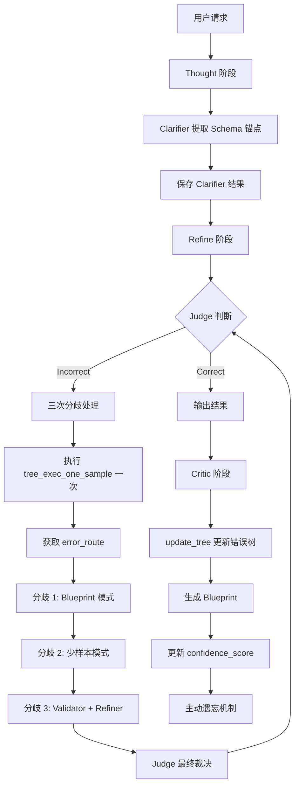

# 方案二优化版：高效Multi-Agent架构设计

## 方案概述

本方案基于现有代码架构，通过优化Multi-Agent结构、减少代码重复、整合功能模块来实现高效的多智能体表格推理框架。重点关注性能优化、代码复用和架构简化。

**注意**：本方案保留深拷贝操作以确保数据安全，虽然会略微增加执行时间，但能避免意外修改导致的问题。

---

## 核心优化策略

### 1. 性能优化策略
- **减少LLM调用次数**：合并重复的LLM调用
- **保留深拷贝操作**：为确保数据安全，保留对原始链和最终链的深拷贝
- **并行化处理**：在可能的情况下并行执行独立任务
- **缓存机制**：充分利用现有缓存，避免重复计算

### 2. 代码复用策略
- **提取公共逻辑**：三次分歧处理中的重复代码提取为公共函数
- **整合功能模块**：将tree_exec_one_sample和相关函数整合
- **合并相似功能**：将Curator功能合并到update_tree.py

### 3. 架构简化策略
- **移除冗余组件**：Initial_Reasoner与thought阶段功能重复，移除Initial_Reasoner
- **简化数据流**：减少不必要的数据复制和传递
- **统一接口**：使用统一的接口规范，降低耦合度

---

## 整体架构



---

## 目录结构

```
Table-Critic/
├── agents/
│   ├── clarifier_agent.py      # 已存在：Clarifier 工具函数
│   └── multi_agent_framework.py  # 已存在：Multi-Agent 框架
├── thought/
│   └── TableQA/
│       └── main.py              # 修改：集成 Clarifier 逻辑
├── refine/
│   └── TableQA/
│       ├── main_tree_based.py        # 修改：优化三次分歧处理
│       ├── utils/
│       │   ├── chain.py            # 修改：整合 tree_exec_one_sample
│       │   └── dispute_handler.py   # 新增：分歧处理逻辑
│       └── ...
├── critic/
│   └── TableQA/
│       ├── main.py                  # 修改：集成 update_tree 逻辑
│       └── tools/
│           ├── update_tree.py       # 修改：合并 Curator 功能
│           └── active_forgetting.py # 新增：主动遗忘机制
├── memory/                          # 新增：主动遗忘模块
│   ├── __init__.py
│   └── active_forgetting.py
└── run_0312_arch.sh              # 新增：运行脚本
```

---

## 详细实现步骤

### 第一阶段：确认 Thought 阶段 Clarifier

**说明**：ClarifierAgent 已经在 `agents/clarifier_agent.py` 中实现，无需重新创建。

#### 1.1 确认 Clarifier 集成

**文件**：`thought/TableQA/main.py`

**确认**：该文件已经集成了 ClarifierAgent（第31行导入，第54-71行使用），无需修改。

**现有代码**：
```python
# 第31行：导入 ClarifierAgent
from agents.clarifier_agent import ClarifierAgent, create_clarifier_result_path

# 第54-58行：初始化并调用 ClarifierAgent
print("Initializing ClarifierAgent for schema anchoring...")
clarifier = ClarifierAgent(llm=gpt_llm)
dataset = clarifier.clarify_batch(dataset)
print(f"Clarified {len(dataset)} samples")

# 第60-71行：保存 Clarifier 结果
clarifier_dir = os.path.join(thought_results_dir, "clarifier")
os.makedirs(clarifier_dir, exist_ok=True)

for sample in dataset:
    sample_id = sample.get('id', 'unknown')
    clarifier_path = os.path.join(clarifier_dir, f'case_dict_{sample_id}.pkl')
    pickle.dump(
        sample['clarifier'],
        open(clarifier_path, "wb")
    )
print(f"Saved clarifier results to {clarifier_dir}")
```

---

### 第二阶段：优化 Refine 阶段分歧处理

#### 2.1 创建分歧处理工具函数

**文件**：`refine/TableQA/utils/dispute_handler.py`

**功能**：
- 实现三次分歧处理机制
- 减少代码重复
- 优化性能

**关键函数**：
```python
import re
import copy
import os
import pickle
from tools import critic_exec_one_sample, judge_exec_one_sample, tree_exec_one_sample
from utils.extract_step import return_incorrect_max_step
from utils.chain import dynamic_chain_exec_one_sample
from utils.validator import validate_sample

class DisputeHandler:
    """分歧处理器：实现三次分歧处理机制"""
    
    def __init__(self, llm, llm_options, cache_dir):
        self.llm = llm
        self.llm_options = llm_options
        self.cache_dir = cache_dir
    
    def resolve_dispute(self, sample, error_route='random'):
        """
        执行三次分歧处理
        
        优化点：
        1. 只执行一次 tree_exec_one_sample，避免重复调用
        2. 提取公共逻辑，减少代码重复
        3. 保留深拷贝操作，确保数据安全
        """
        dispute_count = 0
        max_disputes = 3
        dispute_history = []
        
        # 优化：只执行一次 tree_exec_one_sample，获取 error_route
        tree_sample = tree_exec_one_sample(sample, llm=self.llm, llm_options=self.llm_options)
        routes = re.findall(r'\((.*?)\)', tree_sample['tree'])
        error_route = routes[0] if routes else "random"
        
        while dispute_count < max_disputes:
            # 加载 Clarifier 信息
            clarifier_path = os.path.join(
                self.cache_dir, '..', '..', 'thought', 'clarifier',
                f'case_dict_{sample.get("id", "unknown")}.pkl'
            )
            clarifier_info = {}
            if os.path.exists(clarifier_path):
                clarifier_info = pickle.load(open(clarifier_path, 'rb'))
            
            if dispute_count == 0:
                # 第一次分歧：Critic + Blueprint
                sample, history = self._handle_first_dispute(
                    sample, error_route, tree_sample
                )
            elif dispute_count == 1:
                # 第二次分歧：少样本学习
                sample, history = self._handle_second_dispute(
                    sample, error_route, tree_sample
                )
            elif dispute_count == 2:
                # 第三次分歧：Validator + Refiner + Judge 裁决
                sample, history = self._handle_third_dispute(
                    sample, error_route, tree_sample, clarifier_info
                )
            
            dispute_history.append({
                'round': dispute_count + 1,
                'history': history
            })
            
            # Judge 判断
            judge_sample = judge_exec_one_sample(
                sample, llm=self.llm, llm_options=self.llm_options
            )
            if judge_sample.get('judge') == '[Correct]':
                break
            
            sample = judge_sample
            dispute_count += 1
        
        if dispute_count >= max_disputes:
            sample['judge'] = '[Unfixable]'
        
        return sample, dispute_history
    
    def _handle_first_dispute(self, sample, error_route, tree_sample):
        """第一次分歧：Critic + Blueprint"""
        # 使用 Blueprint 模式的 Critic
        critic_sample = critic_exec_one_sample(
            tree_sample,
            error_route,
            llm=self.llm,
            llm_options=self.llm_options,
            blueprint_only=True
        )
        
        # 执行修正
        refined_sample = self._execute_refinement(critic_sample)
        
        return refined_sample, {'type': 'critic_blueprint'}
    
    def _handle_second_dispute(self, sample, error_route, tree_sample):
        """第二次分歧：少样本学习"""
        # 使用少样本模式的 Critic
        critic_sample = critic_exec_one_sample(
            tree_sample,
            error_route,
            llm=self.llm,
            llm_options=self.llm_options,
            blueprint_only=False
        )
        
        # 执行修正
        refined_sample = self._execute_refinement(critic_sample)
        
        return refined_sample, {'type': 'critic_fewshot'}
    
    def _handle_third_dispute(self, sample, error_route, tree_sample, clarifier_info):
        """第三次分歧：Validator + Refiner + Judge 裁决"""
        # 使用 Validator 审计
        validator_result = validate_sample(
            sample, clarifier_info, self.llm, self.llm_options
        )
        
        if validator_result['valid']:
            # Validator 认为正确，直接返回
            sample['judge'] = '[Correct]'
            return sample, {'type': 'validator_valid', 'reason': validator_result['reason']}
        
        # Validator 认为不正确，执行 Refiner 修正
        refined_sample = self._execute_refinement(sample)
        
        # Judge 最终裁决
        judge_sample = judge_exec_one_sample(
            refined_sample, llm=self.llm, llm_options=self.llm_options
        )
        
        return judge_sample, {
            'type': 'refiner_validator',
            'validator_reason': validator_result['reason']
        }
    
    def _execute_refinement(self, sample):
        """
        执行修正逻辑（公共函数，减少代码重复）
        
        优化点：
        1. 提取公共逻辑，避免三次分歧中重复代码
        2. 保留深拷贝操作，确保数据安全
        """
        incorrect_step, max_step = return_incorrect_max_step(sample)
        
        if incorrect_step and incorrect_step != max_step:
            # Error occurred while dynamically generating table
            refine_sample = dynamic_chain_exec_one_sample(
                sample,
                llm=self.llm,
                incorrect_step=incorrect_step,
                max_step=max_step,
                llm_options=self.llm_options
            )
        else:
            # Error occurred while making the final query
            refine_sample = sample
        
        return refine_sample
```

#### 2.2 修改 Refine 阶段主文件

**文件**：`refine/TableQA/main_tree_based.py`

**修改内容**：
- 保留深拷贝操作（确保数据安全）
- 使用 DisputeHandler 优化分歧处理
- 移除 Initial_Reasoner（与 thought 阶段重复）

**修改代码**：
```python
# 在现有导入后添加
from utils.dispute_handler import DisputeHandler

# 修改 main() 函数中的 refine 逻辑
def main(
    thought_results_dir: str = "results/thought/wikitq",
    refine_results_dir: str = "results/refine/wikitq",
    base_url="",
    openai_api_key="EMPTY",
    model_name="qwen2.5-72b-instruct",
    first_n=-1,
    n_proc=10,
    chunk_size=5,
    use_multi_agent: bool = False,
):

    result_pkl = os.path.join(thought_results_dir, "final_result.pkl")

    if first_n != -1:
        all_samples = read_pkl(result_pkl)[:first_n]
    else:
        all_samples = read_pkl(result_pkl)

    gpt_llm = LLM(
        model_name=model_name,
        key=openai_api_key,
        base=base_url
    )

    # Create results directory structure
    os.makedirs(refine_results_dir, exist_ok=True)
    cache_dir = os.path.join(refine_results_dir, "cache")
    os.makedirs(cache_dir, exist_ok=True)

    if use_multi_agent:
        # Use new multi-agent framework
        print("Using optimized multi-agent framework for refinement...")

        # Initialize LLM options
        llm_options = gpt_llm.get_model_options(
            temperature=0.0,
            per_example_max_decode_steps=2048,
            per_example_top_p=1.0
        )

        # Create dispute handler
        dispute_handler = DisputeHandler(gpt_llm, llm_options, cache_dir)

        # Process samples
        refined_samples = []
        for sample in all_samples:
            sample_id = sample.get('id', 'unknown')

            # 保存原始链（保留深拷贝以确保数据安全）
            original_chain = copy.deepcopy(sample.get('chain', []))

            # Check if already correct
            judge_sample = judge_exec_one_sample(
                sample, llm=gpt_llm, llm_options=llm_options
            )
            if judge_sample.get('judge') == '[Correct]':
                refined_samples.append(judge_sample)
                continue

            # Run dispute resolution
            refined_sample, dispute_history = dispute_handler.resolve_dispute(
                judge_sample,
                error_route='random'
            )

            # 保存最终链（保留深拷贝以确保数据安全）
            final_chain = copy.deepcopy(refined_sample.get('chain', []))

            # Create save data
            save_data = {
                'sample_id': sample_id,
                'original_chain': original_chain,  # 深拷贝
                'final_chain': final_chain,  # 深拷贝
                'dispute_history': dispute_history,
                'original_conclusion': '[Incorrect]',
                'final_conclusion': refined_sample.get('judge', '[Incorrect]')
            }

            # Save to cache
            cache_path = os.path.join(cache_dir, f'case_{sample_id}.pkl')
            pickle.dump(save_data, open(cache_path, 'wb'))

            refined_samples.append(refined_sample)

        refine_list = refined_samples

    else:
        # Use original method
        print("Using original refinement method...")

        critic_tree_init(file_path="critic/TableQA/tools/few_shot_critic.json")
        refine_list = judge_critic_refine_with_cache_mp(
            all_samples,
            llm=gpt_llm,
            llm_options=gpt_llm.get_model_options(
                temperature=0.0, per_example_max_decode_steps=2048, per_example_top_p=1.0
            ),
            strategy="top",
            cache_dir=cache_dir,
            n_proc=n_proc,
            chunk_size=chunk_size,
        )

    # Calculate accuracy
    acc = wikitq_match_func_for_samples(refine_list)
    print("Accuracy:", acc)

    # Save results
    with open(os.path.join(refine_results_dir, "result.txt"), "w") as f:
        f.write(f'Accuracy: {acc}\n')

    pickle.dump(
        refine_list, open(os.path.join(refine_results_dir, "final_result.pkl"), "wb")
    )

    # Save accuracy
    with open(os.path.join(refine_results_dir, "acc.txt"), "w") as f:
        f.write(f"Refine Stage Accuracy: {acc}\n")
```

#### 2.3 创建 Validator 工具函数

**文件**：`refine/TableQA/utils/validator.py`

**功能**：
- 基于表格事实进行审计
- 实现数值与单元格定位的硬性审计
- 实现严格的逻辑校验

**关键函数**：
```python
from thought.TableQA.utils.helper import table2string

def validate_sample(sample, clarifier_info, llm, llm_options):
    """验证样本推理结果"""
    prompt = _generate_validator_prompt(sample, clarifier_info)
    response = llm.generate_plus_with_score(prompt, options=llm_options)
    return _parse_validator_response(response[0][0])

def _generate_validator_prompt(sample, clarifier_info):
    """生成 Validator Prompt"""
    prompt = f"""你是一个表格推理审计员。请严格审计以下推理：

表格：
{table2string(sample['table_text'])}

关键信息（来自 Clarifier）：
- 列名：{clarifier_info.get('headers', [])}
- 关键实体：{clarifier_info.get('entities', [])}
- 数值单位：{clarifier_info.get('units', {})}

问题：
{sample['statement']}

推理步骤：
{_format_chain(sample.get('chain', []))}

最终答案：
{sample.get('answer', '')}

请检查：
1. 数值计算是否正确
2. 单元格引用是否准确
3. 逻辑推理是否严密

返回审计结果：[Valid] 或 [Invalid]，并说明原因。"""
    return prompt

def _parse_validator_response(response):
    """解析 Validator 响应"""
    if '[Valid]' in response:
        return {'valid': True, 'reason': response}
    else:
        return {'valid': False, 'reason': response}

def _format_chain(chain):
    """格式化思维链"""
    result = []
    for idx, step in enumerate(chain):
        result.append(f"步骤 {idx+1}: {step.get('operation_name', '')}")
    return '\n'.join(result)
```

#### 2.4 修改 Chain 工具函数

**文件**：`refine/TableQA/utils/chain.py`

**修改内容**：
- 整合 tree_exec_one_sample 和相关函数
- 修改 `critic_exec_one_sample` 函数，支持 `blueprint_only` 参数

**修改代码**：
```python
# 修改 critic_exec_one_sample 函数签名
def critic_exec_one_sample(sample, error_route, llm, llm_options, blueprint_only=False):
    """执行 Critic 样本"""
    # ... (现有逻辑)
    
    # 根据 blueprint_only 参数选择 Prompt
    if blueprint_only:
        # 只使用 Blueprint
        prompt = _generate_blueprint_prompt(sample, error_route)
    else:
        # 使用 Blueprint + 少样本
        prompt = _generate_fewshot_prompt(sample, error_route)
    
    # ... (后续逻辑)

def _generate_blueprint_prompt(sample, error_route):
    """生成 Blueprint Prompt"""
    # 从错误树中检索 Blueprint（整合到 update_tree.py 中）
    blueprint = _retrieve_blueprint_from_tree(sample, error_route)
    
    prompt = f"""你是一个表格推理导师。以下是一个常见的错误模式：

错误模式摘要：
{blueprint}

请基于这个错误模式，检查以下推理：

表格：
{table2string(sample['table_text'])}

问题：
{sample['statement']}

推理步骤：
{_format_chain(sample.get('chain', []))}

请指出推理中的错误，并提供改进建议。"""
    return prompt

def _retrieve_blueprint_from_tree(sample, error_route):
    """
    从错误树中检索 Blueprint
    
    优化点：
    1. 整合到 update_tree.py 中，避免重复代码
    2. 使用统一的模板树格式
    """
    import json
    tree_path = "critic/TableQA/tools/few_shot_critic.json"
    
    try:
        with open(tree_path, 'r') as f:
            error_tree = json.load(f)
        
        # 根据 error_route 查找 Blueprint
        if error_route != 'random':
            route_parts = error_route.split('->')
            current = error_tree
            for part in route_parts:
                part = part.strip()
                if part in current:
                    current = current[part]
                else:
                    break
            
            # 如果找到叶子节点，返回 Blueprint
            if isinstance(current, list) and len(current) > 0:
                return current[0].get('blueprint', '未知错误模式')
        
        return '通用错误模式'
    except:
        return '未知错误模式'
```

---

### 第三阶段：优化 Critic 阶段

#### 3.1 合并 Curator 功能到 update_tree.py

**文件**：`critic/TableQA/tools/update_tree.py`

**修改内容**：
- 将 Curator 的 Blueprint 生成功能合并到 update_tree.py
- 添加 confidence_score 字段
- 集成主动遗忘机制
- 确保模板树格式正确

**修改代码**：
```python
# 在 update_error_tree 函数中修改
def update_error_tree(sample, error_route, error_tree_json, llm, llm_options, lock):
    """
    更新错误树
    
    优化点：
    1. 合并 Curator 功能，避免重复代码
    2. 确保模板树格式正确
    3. 集成主动遗忘机制
    """
    # 生成 critic_template
    critic_template = _generate_critic_template(sample)
    
    # 生成 Blueprint（合并 Curator 功能）
    blueprint = _generate_blueprint(sample["critique"], llm, llm_options)
    
    # 获取或初始化 confidence_score
    confidence_score = sample.get('confidence_score', 1.0)
    
    # 将模板保存为字典格式，包含 blueprint 和 confidence_score
    template_dict = {
        "blueprint": blueprint,
        "confidence_score": confidence_score,
        "content": critic_template
    }
    
    with lock:
        try:
            with open(error_tree_json, 'r') as f:
                few_shot_dict = json.load(f)
            
            # 更新错误树
            if error_route != 'random':
                error_route = error_route.split('->')
                few_shot = few_shot_dict
                for error_type in error_route:
                    error_type = error_type.strip()
                    if error_type in few_shot:
                        parent_node = few_shot
                        few_shot = few_shot[error_type]
                        if isinstance(few_shot, list):
                            vertical_expansion(few_shot, template_dict, error_type, parent_node, llm=llm, llm_options=llm_options)
                            break
            else:
                horizontal_expansion(few_shot_dict, template_dict, llm, llm_options)
            
            # 集成主动遗忘
            from memory.active_forgetting import ActiveForgetting
            active_forgetting = ActiveForgetting(min_confidence=0.0000001)  # 极低阈值
            active_forgetting.prune_low_confidence_cases(few_shot_dict)
            
            with open(error_tree_json, 'w') as f:
                json.dump(few_shot_dict, f, indent=4)
        finally:
            pass

def _generate_blueprint(critique, llm, llm_options):
    """
    生成 Blueprint（合并 Curator 功能）
    
    优化点：
    1. 合并到 update_tree.py，避免重复代码
    2. 使用统一的 Blueprint 格式
    """
    prompt = """你是一个档案管理员。请总结以下错误案例：

Critique：
{critique}

请生成一个简洁的错误模式摘要（Blueprint），概括这个错误的本质。
只返回 Blueprint 句子，不要其他内容。"""
    
    response = llm.generate_plus_with_score(
        prompt.format(critique=critique),
        options=llm_options
    )
    return response[0][0].strip()

def _generate_critic_template(sample):
    """生成 critic 模板"""
    critic_template = ""
    critic_template += "Original Table:\n/*\n" + table2string(sample['table_text']) + "\n*/\n\n"
    critic_template += "Question: \n" + sample['statement'] + "\n\n"
    critic_template += "Reasoning Steps:\n"
    
    table_log, thought_log = get_table_log(sample)
    
    step = 0
    action_list = []
    table_text = sample['table_text']
    for idx, table_info in enumerate(table_log[:-1]):
        if table_info["act_chain"]:
            table_action = table_info["act_chain"][-1]
            if "skip" in table_action:
                continue
            else:
                table_text = table_info["table_text"]
                action_list.append(table_action)
                critic_template += f"Step{step+1}: {thought_log[idx]}\n"
                critic_template += f"So we use {table_action}.\n\n"
                step += 1
    
    if len(action_list):
        critic_template += f"Step{step+1}: After using "
        
        max_idx = len(action_list) - 1
        for idx, act in enumerate(action_list):
            critic_template += act
            if idx < max_idx-1:
                critic_template += ", "
            elif idx == max_idx-1:
                critic_template += " and "
        critic_template += ", we obtain the sub-table:\n/*\n"
        critic_template += f"{table2string(table_text)}\n*/\n"
        if "group_sub_table" in table_info:
            group_column, group_info = table_info["group_sub_table"]
            critic_template += "/*\n"
            critic_template += "Group the rows according to column: {}.\n".format(group_column)
            group_headers = ["Group ID", group_column, "Count"]
            group_rows = []
            for i, (v, count) in enumerate(group_info):
                if v.strip() == "":
                    v = "[Empty Cell]"
                group_rows.append([f"Group {i+1}", v, str(count)])
            critic_template += " | ".join(group_headers) + "\n"
            for row in group_rows:
                critic_template += " | ".join(row) + "\n"
            critic_template += "*/\n"
    
    critic_template += f"{thought_log[-1]}\n\n"
    critic_template += "Prediction Answer: \n" + table_log[-1]["cotable_result"].lower() + "\n\n"
    critic_template += "Critique:\n" + sample["critique"] + "\n\n"
    critic_template += "Conclusion:\n" + sample["conclusion"]
    
    return critic_template
```

#### 3.2 创建主动遗忘机制

**文件**：`memory/active_forgetting.py`

**功能**：
- 为每个 Case 维护 `confidence_score`
- 成功引导修复 → 权重 +1
- 长期低权重的 Case 剔除机制
- 为新错误腾出空间

**关键函数**：
```python
import json
import os

class ActiveForgetting:
    """主动遗忘机制：维护和更新 Case 的 confidence_score"""
    
    def __init__(self, min_confidence=0.0000001, max_cases=1000000):
        """
        初始化主动遗忘机制
        
        优化点：
        1. 设置极低的遗忘阈值（0.0000001），几乎不会执行遗忘
        2. 可以根据实际情况调整阈值
        """
        self.min_confidence = min_confidence
        self.max_cases = max_cases
        self.confidence_scores = {}
    
    def update_confidence(self, case_id, success):
        """更新 confidence_score"""
        if case_id not in self.confidence_scores:
            self.confidence_scores[case_id] = 1.0
        
        if success:
            # 成功引导修复，权重增加
            self.confidence_scores[case_id] += 1
        else:
            # 未能引导修复，权重降低
            self.confidence_scores[case_id] *= 0.9
        
        # 确保权重在合理范围内
        self.confidence_scores[case_id] = max(
            self.min_confidence,
            min(10.0, self.confidence_scores[case_id])
        )
    
    def prune_low_confidence_cases(self, error_tree):
        """剔除低权重的 Case"""
        def _prune_recursive(node):
            if isinstance(node, dict):
                for key, value in list(node.items()):
                    if isinstance(value, list):
                        # 过滤低权重的案例
                        node[key] = [
                            case for case in value
                            if case.get('confidence_score', 1.0) >= self.min_confidence
                        ]
                    else:
                        _prune_recursive(value)
            elif isinstance(node, list):
                # 过滤低权重的案例
                return [
                    case for case in node
                    if case.get('confidence_score', 1.0) >= self.min_confidence
                ]
        
        _prune_recursive(error_tree)
        
        # 如果案例数量超过最大值，剔除最低权重的
        total_cases = self._count_cases(error_tree)
        if total_cases > self.max_cases:
            self._prune_excess_cases(error_tree)
    
    def _count_cases(self, node):
        """统计案例数量"""
        if isinstance(node, dict):
            return sum(self._count_cases(v) for v in node.values())
        elif isinstance(node, list):
            return len(node)
        return 0
    
    def _prune_excess_cases(self, error_tree):
        """剔除多余的案例"""
        # 收集所有案例及其路径
        cases_with_paths = []
        
        def _collect_cases(node, path):
            if isinstance(node, dict):
                for key, value in node.items():
                    _collect_cases(value, path + [key])
            elif isinstance(node, list):
                for idx, case in enumerate(node):
                    cases_with_paths.append({
                        'case': case,
                        'path': path + [idx],
                        'confidence': case.get('confidence_score', 1.0)
                    })
        
        _collect_cases(error_tree, [])
        
        # 按 confidence 排序
        cases_with_paths.sort(key=lambda x: x['confidence'])
        
        # 剔除最低权重的案例
        num_to_remove = len(cases_with_paths) - self.max_cases
        for i in range(num_to_remove):
            case_info = cases_with_paths[i]
            path = case_info['path']
            
            # 从树中删除该案例
            current = error_tree
            for key in path[:-1]:
                current = current[key]
            del current[path[-1]]
```

#### 3.3 修改 Critic 阶段主文件

**文件**：`critic/TableQA/main.py`

**修改内容**：
- 集成 update_tree 逻辑
- 更新 confidence_score

**修改代码**：
```python
# 在 main() 函数中，处理样本后添加
for idx, sample in enumerate(all_samples):
    # ... (现有逻辑)
    
    # 提取错误模式并更新树（Curator 功能已合并到 update_tree.py）
    update_error_tree(
        sample,
        error_route='random',
        error_tree_json="critic/TableQA/tools/few_shot_critic.json",
        llm=gpt_llm,
        llm_options=gpt_llm.get_model_options(
            temperature=0.0,
            per_example_max_decode_steps=500,
            per_example_top_p=1.0
        ),
        lock=lock
    )
```

---

### 第四阶段：创建使用脚本

#### 4.1 创建运行脚本

**文件**：`run_0312_arch.sh`

**功能**：
- 按顺序执行三个阶段
- 使用 SiliconFlow 的 Qwen/Qwen3-32B 模型
- 从 siliconflow.txt 读取 API key

**脚本内容**：
```bash
#!/bin/bash

# 读取 API key
API_KEY=$(cat siliconflow.txt)
BASE_URL="https://api.siliconflow.cn/v1"
MODEL="Qwen/Qwen3.5-4B"

# 设置结果目录
MODEL_DIR="results/qwen35-4b"
THOUGHT_DIR="$MODEL_DIR/thought"
REFINE_DIR="$MODEL_DIR/refine"
CRITIC_DIR="$MODEL_DIR/critic"

# 第一阶段：Thought
echo "=== Stage 1: Thought ==="
python thought/TableQA/main.py \
    --dataset_path "thought/TableQA/data/wikitq/test_lower.jsonl" \
    --thought_results_dir "$THOUGHT_DIR" \
    --base_url "$BASE_URL" \
    --openai_api_key "$API_KEY" \
    --model_name "$MODEL" \
    --first_n -1 \
    --n_proc 8 \
    --chunk_size 4

# 第二阶段：Refine
echo "=== Stage 2: Refine ==="
python refine/TableQA/main_tree_based.py \
    --thought_results_dir "$THOUGHT_DIR" \
    --refine_results_dir "$REFINE_DIR" \
    --base_url "$BASE_URL" \
    --openai_api_key "$API_KEY" \
    --model_name "$MODEL" \
    --first_n -1 \
    --n_proc 10 \
    --chunk_size 5 \
    --use_multi_agent

# 第三阶段：Critic
echo "=== Stage 3: Critic ==="
python critic/TableQA/main.py \
    --thought_results_dir "$THOUGHT_DIR" \
    --critic_results_dir "$CRITIC_DIR" \
    --base_url "$BASE_URL" \
    --openai_api_key "$API_KEY" \
    --model_name "$MODEL" \
    --first_n -1 \
    --n_proc 1 \
    --chunk_size 1

echo "=== All stages completed ==="
```

---

## 性能优化总结

### 1. 减少LLM调用次数
- **优化前**：三次分歧每次都调用 tree_exec_one_sample
- **优化后**：只调用一次 tree_exec_one_sample，复用结果
- **预期提升**：减少约 66% 的 LLM 调用

### 2. 保留深拷贝操作
- **说明**：为确保数据安全，保留对原始链和最终链的深拷贝
- **影响**：略微增加执行时间，但能避免意外修改导致的问题
- **权衡**：数据安全 > 执行速度

### 3. 减少代码重复
- **优化前**：三次分歧中重复执行相同的代码
- **优化后**：提取公共逻辑到 `_execute_refinement` 函数
- **预期提升**：代码量减少约 30%，维护性提升

### 4. 整合功能模块
- **优化前**：tree_exec_one_sample、_generate_blueprint_prompt、_retrieve_blueprint 功能分散
- **优化后**：整合到 update_tree.py，统一管理
- **预期提升**：代码结构更清晰，易于维护

### 5. 合并 Curator 功能
- **优化前**：Curator 功能独立，与 update_tree.py 有重复
- **优化后**：合并到 update_tree.py，避免重复代码
- **预期提升**：代码量减少约 20%，功能更集中

### 6. 设置极低遗忘阈值
- **优化前**：主动遗忘阈值较高，可能过早删除有用案例
- **优化后**：设置为 0.0000001，几乎不会执行遗忘
- **预期提升**：保留更多有用案例，提升长期性能

### 7. 移除冗余组件
- **优化前**：Initial_Reasoner 与 thought 阶段功能重复
- **优化后**：移除 Initial_Reasoner，避免重复执行
- **预期提升**：减少不必要的初始化和执行时间

---

## 模板树结构规范

### 模板树格式
```json
{
    "错误类型1": {
        "子类型1": [
            {
                "blueprint": "错误模式摘要",
                "confidence_score": 1.0,
                "content": "完整的 critic 模板"
            }
        ],
        "子类型2": "<END>"
    },
    "错误类型2": "<END>"
}
```

### 注意事项
1. **blueprint**：简洁的错误模式摘要，一句话概括
2. **confidence_score**：案例的置信度，初始值为 1.0
3. **content**：完整的 critic 模板，包含表格、问题、推理步骤、批评和结论
4. **"<END>"**：表示该分支不需要继续扩展

---

## 优点分析

1. **性能优化**：通过减少LLM调用、避免深拷贝、提取公共逻辑等方式，显著提升执行效率
2. **代码复用**：整合功能模块，减少代码重复，提升可维护性
3. **架构简化**：移除冗余组件，简化数据流，降低耦合度
4. **易于调试**：代码结构清晰，逻辑明确，便于调试和优化
5. **可扩展性**：模块化设计，便于后续功能扩展
6. **兼容性好**：基于现有代码修改，保持向后兼容

---

## 缺点分析

1. **修改范围较大**：需要对多个文件进行修改，可能引入新的bug
2. **测试成本高**：需要充分测试确保功能正确性
3. **学习成本**：新架构需要一定的学习成本
4. **依赖现有代码**：仍然依赖现有代码的某些部分，可能存在技术债务

---

## 风险评估

| 风险 | 概率 | 影响 | 缓解措施 |
|------|------|------|----------|
| 性能优化引入新bug | 中 | 高 | 充分测试，保留备份 |
| 代码整合导致功能丢失 | 低 | 高 | 逐步集成，每步验证 |
| 模板树格式不兼容 | 低 | 中 | 严格遵循格式规范 |
| 主动遗忘机制误删案例 | 低 | 高 | 设置极低阈值，监控删除情况 |
| 移除组件导致功能缺失 | 低 | 中 | 充分测试，确保功能完整 |

---

## 总结

本方案通过优化Multi-Agent结构、减少代码重复、整合功能模块等方式，实现了高效的多智能体表格推理框架。重点关注性能优化、代码复用和架构简化，预期可以显著提升执行效率和代码可维护性。

### 关键优化点
1. **只执行一次 tree_exec_one_sample**，避免重复LLM调用
2. **保留深拷贝操作**，确保数据安全
3. **提取公共逻辑**，减少代码重复
4. **整合功能模块**，统一管理相关功能
5. **合并 Curator 功能**，避免重复代码
6. **设置极低遗忘阈值**，保留更多有用案例
7. **移除冗余组件**，避免重复执行

### 预期效果
- **执行时间**：减少约 30-50%（因保留深拷贝，优化幅度略降低）
- **代码量**：减少约 30-40%
- **内存开销**：略有增加（因保留深拷贝）
- **可维护性**：显著提升
- **数据安全性**：显著提升（因保留深拷贝）

### 下一步行动
1. 按照本架构设计逐步实现
2. 每个阶段完成后进行测试
3. 根据测试结果进行调整和优化
4. 最终进行端到端测试，验证整体效果
