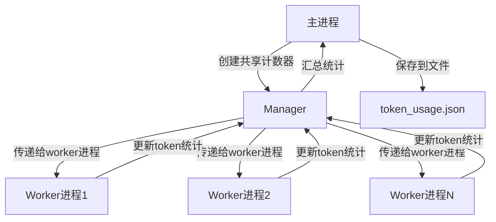

# Token统计实现指南

## 目录
- [问题背景](#问题背景)
- [现状分析](#现状分析)
- [实现方案](#实现方案)
  - [方案一：简单统计（不精确）](#方案一简单统计不精确)
  - [方案二：精确统计（推荐）](#方案二精确统计推荐)
- [详细实现步骤](#详细实现步骤)
- [工作量评估](#工作量评估)
- [注意事项](#注意事项)

---

## 问题背景

运行 [`run_FV.sh`](run_FV.sh) 脚本时，希望能够统计thought阶段和refine阶段的token消耗（input/output分开），以便了解API调用成本。

### 脚本执行流程

[`run_FV.sh`](run_FV.sh) 执行两个Python程序：

1. **Thought 阶段**: [`thought/TableFV/main.py`](thought/TableFV/main.py)
   - Clarifier处理（单进程）
   - 动态链执行（多进程：`n_proc=8`）
   - 最终查询（多进程：`n_proc=4`）

2. **Refine 阶段**: [`refine/TableFV/main_tree_based.py`](refine/TableFV/main_tree_based.py)
   - Controller循环处理（单进程）
   - 或传统方法（多进程）

---

## 现状分析

### LLM调用机制

两个程序都使用 [`LLM`](refine/TableFV/utils/llm.py) 类来调用OpenAI兼容的API（如阿里云DashScope）。

查看 [`generate_plus_with_score()`](refine/TableFV/utils/llm.py:26-79) 方法：

```python
gpt_responses = client.chat.completions.create(
    model=self.model_name,
    messages=messages,
    stop=end_str,
    **options
)
```

虽然OpenAI API的响应对象 `gpt_responses` 包含 `usage` 字段（包括 `prompt_tokens`、`completion_tokens`、`total_tokens`），但当前代码**没有提取和记录这些信息**。

### 全局搜索结果

在整个Table-Critic项目中搜索token统计相关代码，发现：
- ❌ 没有找到 `total_tokens`、`prompt_tokens`、`completion_tokens` 的使用
- ❌ 没有任何token统计或成本追踪功能
- ✅ 只有 `max_tokens` 参数（用于限制输出长度）

### 结论

**当前状态**：无法统计token消耗  
**需要修改**：LLM类需要添加token追踪功能

---

## 实现方案

### 方案一：简单统计（不精确）

#### 实现难度
| 指标 | 评估 |
|------|------|
| **难度等级** | ⭐ 非常简单（1/5） |
| **代码行数** | 约10-15行 |
| **风险等级** | 极低（不影响原有逻辑） |
| **预估时间** | 5-10分钟 |

#### 实现步骤

**1. 修改LLM类添加token统计**

在 [`thought/TableFV/utils/llm.py`](thought/TableFV/utils/llm.py) 和 [`refine/TableFV/utils/llm.py`](refine/TableFV/utils/llm.py) 中添加：

```python
class LLM:
    def __init__(self, model_name, key, base):
        self.model_name = model_name
        self.key = key
        self.base = base
        # 添加token统计
        self.input_tokens = 0
        self.output_tokens = 0
    
    def generate_plus_with_score(self, prompt, options=None, end_str=None):
        # ... 现有代码 ...
        gpt_responses = client.chat.completions.create(...)
        error = None
        
        # 提取token使用信息
        if hasattr(gpt_responses, 'usage') and gpt_responses.usage:
            self.input_tokens += gpt_responses.usage.prompt_tokens
            self.output_tokens += gpt_responses.usage.completion_tokens
        
        # ... 现有代码 ...
    
    def generate_plus_with_score_final_query(self, prompt, options=None, end_str=None):
        # ... 同样添加token统计 ...
    
    def get_token_usage(self):
        """返回token使用统计"""
        return {
            'input_tokens': self.input_tokens,
            'output_tokens': self.output_tokens,
            'total_tokens': self.input_tokens + self.output_tokens
        }
    
    def save_token_usage(self, filepath):
        """保存token使用统计到文件"""
        import json
        import time
        usage = self.get_token_usage()
        usage['timestamp'] = time.strftime('%Y-%m-%d %H:%M:%S')
        usage['model'] = self.model_name
        with open(filepath, 'w') as f:
            json.dump(usage, f, indent=2)
        print(f"Token usage saved to {filepath}")
```

**2. 在thought阶段保存token统计**

在 [`thought/TableFV/main.py`](thought/TableFV/main.py:106-110) 的最后添加：

```python
from utils.evaluate import tabfact_match_func_for_samples
acc = tabfact_match_func_for_samples(final_result)
print(f"Thought Stage Accuracy: {acc}")
with open(os.path.join(thought_results_dir, "acc.txt"), "w") as f:
    f.write(f"Thought Stage Accuracy: {acc}\n")

# 保存token统计（新增）
token_usage = gpt_llm.get_token_usage()
print(f"\nThought Stage Token Usage:")
print(f"  Input Tokens:  {token_usage['input_tokens']}")
print(f"  Output Tokens: {token_usage['output_tokens']}")
print(f"  Total Tokens:  {token_usage['total_tokens']}")
gpt_llm.save_token_usage(os.path.join(thought_results_dir, "token_usage.json"))
```

**3. 在refine阶段保存token统计**

在 [`refine/TableFV/main_tree_based.py`](refine/TableFV/main_tree_based.py:111-113) 的最后添加：

```python
# Save accuracy to acc.txt
with open(os.path.join(refine_results_dir, "acc.txt"), "w") as f:
    f.write(f"Refine Stage Accuracy: {acc}\n")

# 保存token统计（新增）
token_usage = gpt_llm.get_token_usage()
print(f"\nRefine Stage Token Usage:")
print(f"  Input Tokens:  {token_usage['input_tokens']}")
print(f"  Output Tokens: {token_usage['output_tokens']}")
print(f"  Total Tokens:  {token_usage['total_tokens']}")
gpt_llm.save_token_usage(os.path.join(refine_results_dir, "token_usage.json"))
```

#### 运行结果

运行 [`run_FV.sh`](run_FV.sh) 后，会在以下位置生成token统计文件：

```
results/thought_100/tabfact/qwen-plus/token_usage.json
results/refine_100/tabfact/qwen-plus/token_usage.json
```

每个 `token_usage.json` 文件内容示例：

```json
{
  "input_tokens": 150000,
  "output_tokens": 50000,
  "total_tokens": 200000,
  "timestamp": "2026-03-31 09:53:00",
  "model": "qwen-plus"
}
```

#### 局限性

**多进程场景的问题**：
- Thought阶段使用了多进程（[`dynamic_chain_exec_with_cache_mp`](thought/TableFV/main.py:74) 和 [`fixed_chain_exec_mp`](thought/TableFV/main.py:100)）
- 每个子进程会创建独立的LLM实例，token统计会分散在各个进程中
- 主进程的LLM实例只能统计主进程的token使用量
- **结果：多进程部分的token统计不精确**

---

### 方案二：精确统计（推荐）

#### 实现架构



#### 实现难度
| 指标 | 评估 |
|------|------|
| **难度等级** | ⭐⭐ 中等（2/5） |
| **代码行数** | 约110行 |
| **风险等级** | 低（向后兼容） |
| **预估时间** | 1.5-2小时 |

---

## 详细实现步骤

### 步骤1：修改LLM类支持共享计数器

在 [`refine/TableFV/utils/llm.py`](refine/TableFV/utils/llm.py) 和 [`thought/TableFV/utils/llm.py`](thought/TableFV/utils/llm.py) 中修改：

```python
class LLM:
    def __init__(self, model_name, key, base, shared_counter=None):
        self.model_name = model_name
        self.key = key
        self.base = base
        # 支持本地计数器或共享计数器
        if shared_counter is None:
            self.input_tokens = 0
            self.output_tokens = 0
            self._use_shared = False
        else:
            self.shared_counter = shared_counter
            self._use_shared = True
    
    def _add_tokens(self, input_tokens, output_tokens):
        """添加token统计（本地或共享）"""
        if self._use_shared:
            # 使用共享计数器（需要锁保护）
            with self.shared_counter['lock']:
                self.shared_counter['input_tokens'] += input_tokens
                self.shared_counter['output_tokens'] += output_tokens
        else:
            # 使用本地计数器
            self.input_tokens += input_tokens
            self.output_tokens += output_tokens
    
    def generate_plus_with_score(self, prompt, options=None, end_str=None):
        if options is None:
            options = self.get_model_options()
        messages = [
            {
                "role": "system",
                "content": "I will give you some examples, you need to follow the examples and complete the text, and no other content.",
            },
            {"role": "user", "content": prompt},
        ]
        gpt_responses = None
        retry_num = 0
        retry_limit = 2
        error = None
        client = OpenAI(
            api_key=self.key,
            base_url=self.base,
        )
        while gpt_responses is None:
            try:
                gpt_responses = client.chat.completions.create(
                    model=self.model_name,
                    messages=messages,
                    stop=end_str,
                    **options
                )
                error = None
            except Exception as e:
                print(str(e), flush=True)
                error = str(e)
                if "This model's maximum context length is" in str(e):
                    print(e, flush=True)
                    gpt_responses = {
                        "choices": [{"message": {"content": "PLACEHOLDER"}}]
                    }
                elif retry_num > retry_limit:
                    error = "too many retry times"
                    gpt_responses = {
                        "choices": [{"message": {"content": "PLACEHOLDER"}}]
                    }
                else:
                    time.sleep(60)
                retry_num += 1
        if error:
            raise Exception(error)
        
        # 提取token使用信息（新增）
        if hasattr(gpt_responses, 'usage') and gpt_responses.usage:
            self._add_tokens(
                gpt_responses.usage.prompt_tokens,
                gpt_responses.usage.completion_tokens
            )
        
        results = []
        for i, res in enumerate(gpt_responses.choices):
            text = res.message.content
            fake_conf = (len(gpt_responses.choices) - i) / len(
                gpt_responses.choices
            )
            results.append((text, np.log(fake_conf)))

        return results

    def generate_plus_with_score_final_query(self, prompt, options=None, end_str=None):
        if options is None:
            options = self.get_model_options()
        messages = [
            {
                "role": "system",
                "content": "You are a helpful assistant.",
            },
            {"role": "user", "content": prompt},
        ]
        gpt_responses = None
        retry_num = 0
        retry_limit = 2
        error = None
        client = OpenAI(
            api_key=self.key,
            base_url=self.base,
        )
        while gpt_responses is None:
            try:
                gpt_responses = client.chat.completions.create(
                    model=self.model_name,
                    messages=messages,
                    stop=end_str,
                    **options
                )
                error = None
            except Exception as e:
                print(str(e), flush=True)
                error = str(e)
                if "This model's maximum context length is" in str(e):
                    print(e, flush=True)
                    gpt_responses = {
                        "choices": [{"message": {"content": "PLACEHOLDER"}}]
                    }
                elif retry_num > retry_limit:
                    error = "too many retry times"
                    gpt_responses = {
                        "choices": [{"message": {"content": "PLACEHOLDER"}}]
                    }
                else:
                    time.sleep(60)
                retry_num += 1
        if error:
            raise Exception(error)
        
        # 提取token使用信息（新增）
        if hasattr(gpt_responses, 'usage') and gpt_responses.usage:
            self._add_tokens(
                gpt_responses.usage.prompt_tokens,
                gpt_responses.usage.completion_tokens
            )
        
        results = []
        for i, res in enumerate(gpt_responses.choices):
            text = res.message.content
            fake_conf = (len(gpt_responses.choices) - i) / len(
                gpt_responses.choices
            )
            results.append((text, np.log(fake_conf)))

        return results

    def generate(self, prompt, options=None, end_str=None):
        if options is None:
            options = self.get_model_options()
        options["n"] = 1
        result = self.generate_plus_with_score(prompt, options, end_str)[0][0]
        return result
    
    def get_token_usage(self):
        """返回token使用统计"""
        if self._use_shared:
            # 从共享计数器读取
            with self.shared_counter['lock']:
                return {
                    'input_tokens': self.shared_counter['input_tokens'].value,
                    'output_tokens': self.shared_counter['output_tokens'].value,
                    'total_tokens': self.shared_counter['input_tokens'].value + self.shared_counter['output_tokens'].value
                }
        else:
            # 从本地计数器读取
            return {
                'input_tokens': self.input_tokens,
                'output_tokens': self.output_tokens,
                'total_tokens': self.input_tokens + self.output_tokens
            }
    
    def save_token_usage(self, filepath):
        """保存token使用统计到文件"""
        import json
        import time
        usage = self.get_token_usage()
        usage['timestamp'] = time.strftime('%Y-%m-%d %H:%M:%S')
        usage['model'] = self.model_name
        with open(filepath, 'w') as f:
            json.dump(usage, f, indent=2)
        print(f"Token usage saved to {filepath}")
```

### 步骤2：创建共享计数器辅助函数

在 [`refine/TableFV/utils/chain.py`](refine/TableFV/utils/chain.py) 和 [`thought/TableFV/utils/chain.py`](thought/TableFV/utils/chain.py) 开头添加：

```python
def create_shared_token_counter():
    """创建共享的token计数器"""
    manager = mp.Manager()
    return {
        'input_tokens': manager.Value('i', 0),
        'output_tokens': manager.Value('i', 0),
        'lock': manager.Lock()
    }

def get_shared_token_usage(shared_counter):
    """从共享计数器获取token统计"""
    with shared_counter['lock']:
        return {
            'input_tokens': shared_counter['input_tokens'].value,
            'output_tokens': shared_counter['output_tokens'].value,
            'total_tokens': shared_counter['input_tokens'].value + shared_counter['output_tokens'].value
        }
```

### 步骤3：修改多进程函数接受共享计数器

#### 修改 `dynamic_chain_exec_with_cache_mp`

在 [`refine/TableFV/utils/chain.py`](refine/TableFV/utils/chain.py:870-896) 和 [`thought/TableFV/utils/chain.py`](thought/TableFV/utils/chain.py) 中修改：

```python
def dynamic_chain_exec_with_cache_mp(
    all_samples,
    llm,
    llm_options=None,
    strategy="voting",
    cache_dir="./results/debug",
    n_proc=10,
    chunk_size=50,
    shared_counter=None,  # 新增参数
):
    os.makedirs(cache_dir, exist_ok=True)
    result_samples = [None for _ in range(len(all_samples))]
    args = [
        (idx, sample, llm, llm_options, strategy, cache_dir, shared_counter)
        for idx, sample in enumerate(all_samples)
    ]

    with mp.Pool(n_proc) as p:
        for idx, proc_sample in tqdm(
            p.imap_unordered(
                _dynamic_chain_exec_with_cache_mp_core, args, chunksize=chunk_size
            ),
            total=len(all_samples),
            desc=f"Dynamic chain execution with critique"
        ):
            result_samples[idx] = proc_sample

    return result_samples
```

#### 修改 `_dynamic_chain_exec_with_cache_mp_core`

在 [`refine/TableFV/utils/chain.py`](refine/TableFV/utils/chain.py:843-867) 和 [`thought/TableFV/utils/chain.py`](thought/TableFV/utils/chain.py) 中修改：

```python
def _dynamic_chain_exec_with_cache_mp_core(arg):
    idx, sample, llm, llm_options, strategy, cache_dir, shared_counter = arg
    
    # 如果有共享计数器，创建新的LLM实例使用它
    if shared_counter is not None:
        from utils.llm import LLM
        llm = LLM(
            model_name=llm.model_name,
            key=llm.key,
            base=llm.base,
            shared_counter=shared_counter
        )
    
    cache_filename = "case-{}.pkl"
    try:
        sample_id = sample["id"]
        cache_path = os.path.join(cache_dir, cache_filename.format(idx))
        if os.path.exists(cache_path):
            proc_sample = pickle.load(open(cache_path, "rb"))
        else:
            if sample['conclusion'] == '[Correct]':
                proc_sample = sample
            else:
                incorrect_step, max_step = return_incorrect_max_step(sample)
                if incorrect_step != max_step:
                    proc_sample = dynamic_chain_exec_one_sample(
                        sample, llm=llm, incorrect_step=incorrect_step, 
                        max_step=max_step, llm_options=llm_options, strategy=strategy
                    )
                else:
                    proc_sample = sample
            pickle.dump((proc_sample), open(cache_path, "wb"))
        return idx, proc_sample
    except Exception as e:
        print(f"FV-chain.py-_dynamic_chain_exec_with_cache_mp_core Error in {sample_id}: {e}", flush=True)
        return idx, None
```

#### 修改 `fixed_chain_exec_mp` 和相关函数

类似地，需要修改 [`fixed_chain_exec_mp`](refine/TableFV/utils/chain.py:19-34) 和 [`conduct_single_solver_mp`](refine/TableFV/utils/chain.py:69-87) 函数，添加 `shared_counter` 参数并传递给worker函数。

### 步骤4：修改主程序使用共享计数器

#### 修改 `thought/TableFV/main.py`

```python
from utils.chain import create_shared_token_counter, get_shared_token_usage

def main(
    dataset_path: str = "thought/TableFV/data/tabfact/test.jsonl",
    raw2clean_path: str ="thought/TableFV/data/tabfact/raw2clean.jsonl",
    thought_results_dir: str = "results/thought/tabfact",
    base_url="",
    openai_api_key="EMPTY",
    model_name="qwen2.5-72b-instruct",
    first_n=-1,
    n_proc=8,
    chunk_size=4,
):
    dataset = load_tabfact_dataset(dataset_path, raw2clean_path, first_n=first_n)

    # 创建共享token计数器
    shared_counter = create_shared_token_counter()

    gpt_llm = LLM(
        model_name=model_name,
        key=openai_api_key,
        base=base_url,
        shared_counter=shared_counter  # 传递共享计数器
    )

    os.makedirs(thought_results_dir, exist_ok=True)
    
    # Initialize ClarifierAgent and extract schema anchors
    print("Initializing ClarifierAgent for schema anchoring...")
    clarifier = ClarifierAgent(llm=gpt_llm)
    dataset = clarifier.clarify_batch(dataset)
    print(f"Clarified {len(dataset)} samples")

    # Save clarifier results
    clarifier_dir = os.path.join(thought_results_dir, "clarifier")
    os.makedirs(clarifier_dir, exist_ok=True)

    for sample in dataset:
        sample_id = sample.get('id', 'unknown')
        clarifier_path = os.path.join(clarifier_dir, f'case_dict_{sample_id}.pkl')
        pickle.dump(
            sample['clarifier'],
            open(clarifier_path, "wb")
        )
    print(f"Saved clarifier results to {clarifier_dir}")

    # 传递共享计数器到多进程函数
    proc_samples, _ = dynamic_chain_exec_with_cache_mp(
        dataset,
        llm=gpt_llm,
        llm_options=gpt_llm.get_model_options(
            temperature=0.0, per_example_max_decode_steps=2048, per_example_top_p=1.0
        ),
        strategy="top",
        cache_dir=os.path.join(thought_results_dir, "cache"),
        n_proc=n_proc,
        chunk_size=chunk_size,
        shared_counter=shared_counter  # 传递共享计数器
    )
    
    fixed_chain = [
        (
            "Simple query",
            simple_query,
            dict(use_demo=True),
            dict(
                temperature=0, per_example_max_decode_steps=2048, per_example_top_p=1.0
            ),
        ),
    ]

    final_path = os.path.join(thought_results_dir, "final_result.pkl")
    if os.path.exists(final_path):
        final_result = read_pkl(final_path)
    else:
        final_result, _ = fixed_chain_exec_mp(gpt_llm, proc_samples, fixed_chain, n_proc=4, chunk_size=2, shared_counter=shared_counter)

        pickle.dump(
            final_result, open(os.path.join(thought_results_dir, "final_result.pkl"), "wb")
        )
        
    from utils.evaluate import tabfact_match_func_for_samples
    acc = tabfact_match_func_for_samples(final_result)
    print(f"Thought Stage Accuracy: {acc}")
    with open(os.path.join(thought_results_dir, "acc.txt"), "w") as f:
        f.write(f"Thought Stage Accuracy: {acc}\n")

    # 保存token统计（从共享计数器读取）
    token_usage = get_shared_token_usage(shared_counter)
    print(f"\nThought Stage Token Usage:")
    print(f"  Input Tokens:  {token_usage['input_tokens']}")
    print(f"  Output Tokens: {token_usage['output_tokens']}")
    print(f"  Total Tokens:  {token_usage['total_tokens']}")
    
    # 保存到文件
    import json
    import time
    token_usage['timestamp'] = time.strftime('%Y-%m-%d %H:%M:%S')
    token_usage['model'] = model_name
    with open(os.path.join(thought_results_dir, "token_usage.json"), "w") as f:
        json.dump(token_usage, f, indent=2)
```

#### 修改 `refine/TableFV/main_tree_based.py`

```python
from utils.chain import create_shared_token_counter, get_shared_token_usage

def main(
    thought_results_dir: str = "results/thought_100/tabfact/qwen3:14b",
    refine_results_dir: str = "results/refine_100_control/tabfact/qwen3:14b",
    base_url="http://localhost:11434/v1",
    openai_api_key="EMPTY",
    model_name="qwen3:14b",
    first_n=-1,
    n_proc=1,
    chunk_size=1,
    use_controller: bool = True,
    use_clarifier: bool = True,
):
    result_pkl = os.path.join(thought_results_dir, "final_result.pkl")

    if first_n != -1:
        all_samples = read_pkl(result_pkl)[:first_n]
    else:
        all_samples = read_pkl(result_pkl)

    # 创建共享token计数器
    shared_counter = create_shared_token_counter()

    gpt_llm = LLM(
        model_name=model_name,
        key=openai_api_key,
        base=base_url,
        shared_counter=shared_counter  # 传递共享计数器
    )
    
    # Create results directory structure
    os.makedirs(refine_results_dir, exist_ok=True)
    cache_dir = os.path.join(refine_results_dir, "cache")
    os.makedirs(cache_dir, exist_ok=True)

    if use_controller:
        # Use controller-based refinement
        print("Using controller-based refinement...")
        print(f"Clarifier enabled: {use_clarifier}")

        # Initialize critic tree
        critic_tree_init(file_path="critic/TableFV/tools/few_shot_critic.json")

        # Process samples with controller
        refined_samples = []
        for idx, sample in tqdm(enumerate(all_samples), total=len(all_samples), desc="Controller-based refinement"):
            sample_id = sample.get('id', idx)

            # Use Controller main loop with cache support
            refined_sample = controller_main_loop(
                sample,
                llm=gpt_llm,
                llm_options=gpt_llm.get_model_options(
                    temperature=0,
                    per_example_max_decode_steps=2048,
                    per_example_top_p=1
                ),
                max_iterations=2,
                cache_dir=cache_dir,
                sample_idx=idx,
                use_clarifier=use_clarifier,
                thought_results_dir=thought_results_dir,
            )

            refined_samples.append(refined_sample)

        refine_list = refined_samples

    else:
        # Use original method
        print("Using original refinement method...")

        critic_tree_init(file_path="critic/TableFV/tools/few_shot_critic.json")
        refine_list = judge_critic_refine_with_cache_mp(
            all_samples,
            llm=gpt_llm,
            llm_options=gpt_llm.get_model_options(
                temperature=0.0, per_example_max_decode_steps=2048, per_example_top_p=1.0
            ),
            strategy="top",
            cache_dir=os.path.join(refine_results_dir, "cache"),
            n_proc=n_proc,
            chunk_size=chunk_size,
            shared_counter=shared_counter  # 传递共享计数器
        )

    acc = tabfact_match_func_for_samples(refine_list)
    print("Accuracy:", acc)

    print(
        f'Accuracy: {acc}',
        file=open(os.path.join(refine_results_dir, "result.txt"), "w")
    )
    pickle.dump(
        refine_list, open(os.path.join(refine_results_dir, "final_result.pkl"), "wb")
    )

    # Save accuracy to acc.txt
    with open(os.path.join(refine_results_dir, "acc.txt"), "w") as f:
        f.write(f"Refine Stage Accuracy: {acc}\n")

    # 保存token统计（从共享计数器读取）
    token_usage = get_shared_token_usage(shared_counter)
    print(f"\nRefine Stage Token Usage:")
    print(f"  Input Tokens:  {token_usage['input_tokens']}")
    print(f"  Output Tokens:  {token_usage['output_tokens']}")
    print(f"  Total Tokens:  {token_usage['total_tokens']}")
    
    # 保存到文件
    import json
    import time
    token_usage['timestamp'] = time.strftime('%Y-%m-%d %H:%M:%S')
    token_usage['model'] = model_name
    with open(os.path.join(refine_results_dir, "token_usage.json"), "w") as f:
        json.dump(token_usage, f, indent=2)
```

---

## 工作量评估

### 方案一：简单统计

| 任务 | 代码行数 | 预估时间 | 难度 |
|------|---------|---------|------|
| 修改LLM类 | ~15行 | 10分钟 | ⭐ |
| 修改主程序 | ~10行 | 5分钟 | ⭐ |
| 测试验证 | - | 10分钟 | ⭐ |
| **总计** | **~25行** | **~25分钟** | **⭐** |

### 方案二：精确统计

| 任务 | 代码行数 | 预估时间 | 难度 |
|------|---------|---------|------|
| 修改LLM类（thought和refine） | ~80行 | 30分钟 | ⭐⭐ |
| 创建辅助函数 | ~20行 | 10分钟 | ⭐ |
| 修改多进程函数 | ~30行 | 30分钟 | ⭐⭐⭐ |
| 修改主程序（thought和refine） | ~40行 | 20分钟 | ⭐⭐ |
| 测试验证 | - | 30分钟 | ⭐⭐ |
| **总计** | **~170行** | **~2小时** | **⭐⭐** |

---

## 注意事项

### 方案一（简单统计）

1. **多进程场景的局限性**：
   - Clarifier阶段（单进程）：精确统计
   - 多进程部分：只能统计主进程的token使用量
   - Refine阶段（单进程循环）：精确统计

2. **推荐做法**：
   - 如果只是想大致了解token消耗，此方案已经足够
   - 对于多进程部分，可以估算（样本数 × 平均token数）

### 方案二（精确统计）

1. **性能影响**：
   - 锁操作会带来轻微性能开销，但对token统计影响可忽略

2. **内存占用**：
   - 共享计数器占用内存很小，可以忽略

3. **兼容性**：
   - 需要同时修改 `thought/TableFV` 和 `refine/TableFV` 的代码
   - 需要同时修改 `thought/TableFV/utils/chain.py` 和 `refine/TableFV/utils/chain.py`
   - 需要同时修改 `thought/TableFV/utils/llm.py` 和 `refine/TableFV/utils/llm.py`

4. **测试建议**：
   - 先用小数据集（如 `first_n=10`）测试验证
   - 确认token统计正确后再运行完整数据集

5. **第三方API兼容性**：
   - 部分第三方API（如vLLM、Ollama）可能不返回usage信息
   - 需要做容错处理（已有 `hasattr` 检查）

### 通用注意事项

1. **备份代码**：
   - 修改前建议备份原始代码
   - 或者使用git进行版本控制

2. **逐步实施**：
   - 建议先实施方案一，验证基本功能
   - 如需精确统计，再升级到方案二

3. **日志记录**：
   - 建议在控制台输出token统计信息
   - 便于实时监控和调试

4. **成本估算**：
   - 根据token统计可以估算API调用成本
   - 不同API提供商的定价不同

---

## 附录：文件清单

### 需要修改的文件

#### 方案一（简单统计）
- [`thought/TableFV/utils/llm.py`](thought/TableFV/utils/llm.py)
- [`refine/TableFV/utils/llm.py`](refine/TableFV/utils/llm.py)
- [`thought/TableFV/main.py`](thought/TableFV/main.py)
- [`refine/TableFV/main_tree_based.py`](refine/TableFV/main_tree_based.py)

#### 方案二（精确统计）
- [`thought/TableFV/utils/llm.py`](thought/TableFV/utils/llm.py)
- [`refine/TableFV/utils/llm.py`](refine/TableFV/utils/llm.py)
- [`thought/TableFV/utils/chain.py`](thought/TableFV/utils/chain.py)
- [`refine/TableFV/utils/chain.py`](refine/TableFV/utils/chain.py)
- [`thought/TableFV/main.py`](thought/TableFV/main.py)
- [`refine/TableFV/main_tree_based.py`](refine/TableFV/main_tree_based.py)

### 生成的文件

运行后会生成以下文件：
- `results/thought_100/tabfact/{model_name}/token_usage.json`
- `results/refine_100/tabfact/{model_name}/token_usage.json`

---

## 总结

| 方案 | 精确度 | 实现难度 | 时间 | 推荐场景 |
|------|--------|---------|------|---------|
| 方案一 | 中等（多进程不精确） | ⭐ | 25分钟 | 快速评估成本 |
| 方案二 | 高（精确统计） | ⭐⭐ | 2小时 | 需要精确成本核算 |

**推荐**：先实施方案一验证功能，如需精确统计再升级到方案二。

---

*文档生成时间：2026-03-31*  
*版本：v1.0*
